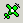
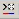
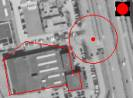

Espa
====

## Meten met EspaCity

T.b.v het 3D voorverkennen wordt gebruik gemaakt van stereo software van het Finse bedrijf ESPA Systems Ltd. 
Voor het stereo digitaliseren van objecten wordt gebruik gemaakt van het onderdeel EspaCity.

Voordat je begint met meten in EspaCity moet je enkele [voorbereidingen treffen](#espacity---voorbereidingen). 
Daarna kun je objecten [aanbrengen](#espacity---objecten-aanbrengen) en [wijzigen](#espacity---objecten-wijzigen).

Meer informatie over het werken met Espa vindt je in de [FAQ](#espacity-frequently-asked-questions-faqs) en [Toetsenbord](#espacity---toetsenbord).

**EspaCity** wordt gebruikt voor 3-D data-acquisitie van digitale luchtfoto's. Het is ontworpen om iedereen die met ruimtelijke gegevens werkt, fotogrammetrische hulpmiddelen ter beschikking te stellen . Het biedt gereedschap voor het opmeten vanaf digitale luchtfoto's van objecten zoals gebouwen, wegen en terreinen . In **EspaCity**, kan een driedimensionale data-acquisitie worden uitgevoerd met of zonder stereoscopische weergave. Men heeft met **EspaCity** de beschikking over functies zoals het automatisch genereren van digitale hoogte modellen, het automatische genereren (en bewerken) van digitale terreinmodellen en de berekening van vloeiende contouren lijn.

**EspaCity** biedt vele mogelijkheden voor het controleren van de kwaliteit van de ruimtelijke gegevens. Reeds ingevoerde ruimtelijke objecten kunnen worden geprojecteerd op de beelden om te onderzoeken hoe deze met de werkelijk overeenkomen en waar nodig worden aangepast. **EspaCity** biedt verder de mogelijkheid om geautomatiseerd bestaande tweedimensionale vector gegevens te converteren naar een driedimensionaal model. Het gebruik van digitale luchtfoto's maakt het onderhoud van ruimtelijke databases wezenlijk eenvoudiger.

## EspaCity - Voorbereidingen

Voordat je met geometrie meten begint moet je de volgende stappen uitvoeren:

### EspaCity starten
> Precondities: [Instellingen](../../Esri/Esri_ArcMap/Instellingen.html)

- Maak de toolbar TOP10NL EspaCity zichtbaar:
  
- Start EspaCity met de knop _EspaCity_ start:
  
- Zodra EspaCity is gestart wordt deze knop uitgegrijsd en wordt de knop _EspaCity_ stop actief:
  
- Zorg ervoor dat EspaCity op het linker scherm gepositioneerd is (als daarop de Z-screen geplaatst is) en ArcMap op het rechter scherm.

> Het is niet toegestaan om EspaCity via de windows startmenu te starten

### Instellingen
> - Om gewijzigde instellingen in EspaCity te bewaren, moet je na de wijzigingen altijd 'File -> Save Settings' doen.
> - De onderstaande instellingen hoef je maar 1 keer doen. Elke keer dat je met EspaCity werkt worden de ingestelde waarden gebruikt.

- Kies de toetsenbordindeling via: "Settings -> Keymap->Edit Keymap…". 
  Druk in het geopende venster "Key Mapping" op de knop _Options_... 
  In het venster "Keymap Select" kies je voor "User Keymap" en via browse selecteer je het bestand 'C:\\Program Files\\Kadaster\\Top10NL\\Config\\EspaCity\\espakey.kbc'. 
  Bevestig beide vensters met OK.
- Via "Settings->Cursor Extra" moeten de opties 'Auto in' en 'Auto out' aangevinkt zijn
- Via "Settings->Imagery" moet de optie 'Load Only Existing Images' aangevinkt zijn
- Via "Settings -> Imagery" moet de optie "Autoload Stereopairs" aangevinkt zijn
- Via "Settings->Transfer" moet de optie 'Use 2D layer' aangevinkt zijn
- Via "Settings->Transfer" moet de optie 'Ask save before exit' uitgevinkt staan
- Via "Settings -> Remote Application en Stereo -> Rotate" uitvinken
- Via "Settings -> Remote Application en Stereo -> Update 2D layer aanvinken
- Via "Settings -> Remote Application en Stereo -> Zoom Automatically" uitvinken
- Via "Settings -> Remote Application en Stereo -> No Update" aanvinken
- Via "Settings -> Stereo Open -> Use Strip Check" moet uitgevinkt zijn
- Via "Settings -> Search -> Parameters..." de optie 'Beep' uitvinken 
  
- Druk op "Save" en sluit het venster.
- Via "Tools -> Remote Application" moet de "Operations" toolbar aangevinkt worden. De eerste keer verschijnt deze toolbar linksboven in het EspaCity scherm. Verplaats het naar een logische plek indien nodig. Benadrukt wordt dat deze toolbar behoort bij EspaCity. 

- Settings bewaren via "File -> Save settings".
  Daarna verschijnt ter informatie een melding, die je kan wegklikken: 
  . 
  Bovengenoemde instellingen behoeven **éénmalig** gedaan te worden. 
  De stereosettings worden door een stuurbestand geregeld. De gebruiker hoeft daarbij niets in te stellen.

### ".els" bestand laden
Laad het els bestand via "File -> Open Imagery…". Blader naar het pad D:\\raster\\stereo\\&lt;bladnr&gt; en selecteer het daarin voorkomende _els_-bestand.

### Connectie maken tussen ArcMap en EspaCity
- Maak een connectie tussen ArcMap en EspaCity door een edit sessie te starten
  .
- Zodra de connectie tot stand gebracht is wordt de knop EspaCity _disconnect_
  
  actief. Met deze knop kun je de connectie verbreken.
- Als je al een edit sessie gestart hebt gebruik dan EspaCity _connect_
  
  om een connectie te maken.
- Overigens wordt de connectie automatisch verbroken na stop editing
  .
  Hierna worden weer zowel de connect als de disconnect button uitgegrijsd.
- Er zijn drie manieren om te controleren of er verbinding is gemaakt:
  1. In ArcMap is de _EspaCity disconnect_ knop
     
     benaderbaar.
  2. Rechtsonder het EspaCity scherm zijn twee horizontale groene streepjes te zien:
     
  3. De knop 'Open stereo' van de 'Operations' toolbar in EspaCity is benaderbaar:
     .
     - Open stereo
        
       Hiermee open je het stereobeeld van het ingezoomde gebied uit ArcMap in EspaCity. 
       Tegelijkertijd lichten de andere buttons in de toolbar op.
- Transfer to 2D
  . 
  Hiermee haal je de objecten uit ArcMap over naar EspaCity. Dit kan ook met toets **u**.

> Met de knop 'Move to Area'
> 
> geef je het actuele gebied uit EspaCity in ArcMap weer.

## EspaCity - Objecten aanbrengen

Maak een objectdefinitie actief met de [Object Wizard](../../Esri/Esri_ArcMap/Object_Wizard.html). 
Zodra je een object hebt gemaakt is het zowel in EspaCity als in ArcMap zichtbaar.

### Rechthoekig vlakobject
Als voorbeeld objectdefinitie _Huis/gebouw_.

|     |     |     |
| --- | --- | --- |
| 1   | Selecteer _Huis/Gebouw_ in de [Object Wizard](../../Esri/Esri_ArcMap/Object_Wizard.html) | |
| 2   | Digitaliseer het huis/gebouw. |  |
| 3   | Eindig met toets **g**, vóórdat je het laatste hoekpunt plaatst. | |

> Als een object uit zowel rechte als scheve hoeken bestaat kun je tijdens het digitaliseren afwisselend de toetsen **s** voor scheef en toets **r** voor recht gebruiken.

### Niet rechthoekig vlakobject
Als voorbeeld objectdefinitie _Huizenblok_.

|     |     |     |
| --- | --- | --- |
| 1   | Selecteer _Huizenblok_ in de [Object Wizard](../../Esri/Esri_ArcMap/Object_Wizard.html) | |
| 2   | Digitaliseer het huizenblok. |  |
| 3   | Eindig met toets **z**, nadat je het laatste hoekpunt plaatst. | |

### Rond vlakobject
Als voorbeeld objectdefinitie _Tank_.

|     |     |     |
| --- | --- | --- |
| 1   | Selecteer _Tank_ in de [Object Wizard](../../Esri/Esri_ArcMap/Object_Wizard.html) | |
| 2   | Digitaliseer 3 omtrekpunten van de tank. |  |
| 3   | Eindig met toets **t**. | |

### Lijn object
In EspaCity kunnen alle lijnobjecten gemaakt worden. Of dat mag is afhankelijk van de afspraken die binnen afdeling Productie hierover gemaakt zijn. Raadpleeg je manager of senior. 

Als voorbeeld objectdefinitie _Sloot1_.

|     |     |     |
| --- | --- | --- |
| 1   | Selecteer _Sloot1_ in de [Object Wizard](../../Esri/Esri_ArcMap/Object_Wizard.html) . | |
| 2   | Digitaliseer de sloot. |  |
| 3   | Eindig met toets **l** ("el"). | |

## EspaCity - Objecten wijzigen

### Precondities
De te wijzigen objecten moeten op het actieve level zijn

In EspaCity kunnen alle objecten gewijzigd worden. 
Dit kan alleen als ze op de actieve level zijn gebracht middels toets **e**. 
Het actieve level is een 3D level, waarbij een z-coördinaat vereist is. 
Aangezien de TOP10NL objecten deze niet hebben, krijgen ze automatisch 0 als z-coördinaat, als ze naar het actieve level gebracht zijn.

> Aangezien het fotobeeld op N.A.P hoogte is, kan het op die plekken waar de N.A.P ongelijk aan 0 is, vermoeiend zijn voor de ogen, omdat fotobeeld en objecten niet op één niveau zijn.

Voor alle edit handelingen dienen eerst de volgende stappen doorlopen te worden:

|     |     |     |
| --- | --- | --- |
| 1   | Druk op toets **e** om de objecten naar het actieve level te plaatsen | |
| 2   | Breng de cursor m.b.v. het draaiwieltje naar het niveau van het te wijzigen object |  |
| 3   | Geef een data op een edge. De vertices van het object worden zichtbaar: | |

> Na wijzigen van een rechthoekig object, zijn de hoeken niet meer haaks

### Vertex toevoegen

|     |     |     |
| --- | --- | --- |
| 1   | Geef een data op een edge |  |
| 2   | Verplaats de cursor |  |
| 3   | Data op nieuwe locatie. Er onstaat een nieuwe vertex |  |
| 4   | Eindig met een data ergens naast het object |  |

### Vertex verplaatsen

|     |     |     |
| --- | --- | --- |
| 1   | Data op de vertex |  |
| 2   | Verplaats de cursor |  |
| 3   | Data op nieuwe lokatie |  |
| 4   | Eindig met een data ergens naast het object |  |

### Vertex verwijderen

|     |     |     |
| --- | --- | --- |
| 1   | Data op de vertex |  |
| 2   | Druk op **delete**. De vertex is verwijderd. |  |
| 3   | Eindig met een data naast het object |  |

### Object verwijderen

|     |     |
| --- | --- |
| 1   | Selecteer het object |
| 2   | Verwijder het object met toets **delete**. |

## EspaCity - Frequently asked questions (Faqs)

### Snappen
Omdat er in een TOP10NL dataset geen 'gaten' mogen zijn tussen vlakobjecten van de types wegdeel, waterdeel en terrein is het handig om tijdens het digitaliseren in EspaCity gebruik te maken van de snapmogelijkheden:
- Toets **x**: snap naar een vertex 
- Toets **v**: snap naar een edge

**Een voorbeeld:** 
Digitaliseren van een 'Meer' aan een Bebouwd gebied: 

- Kies objectdefinitie "Meer/plas".
- Ga in de buurt van punt A, druk op toets **x** en bevestig met **enter**
- Ga in de buurt van punt B, druk op toets **x** en bevestig met **enter**
- Teken het object verder op de reguliere manier

Het 'Meer' sluit precies aan bij het bebouwd gebied aan de zijde AB: 

> Als je met de linker muisknop bevestigt i.p.v met **enter**, is het mogelijk dat de twee vertices niet goed op elkaar aansluiten, vanwege een onbewuste muisbeweging.

### Stereobeeld
Om goed stereobeeld te kunnen zien moet het knopje aan de achterkant van de Z-screen ingesteld zijn op 'CrystalEyes'. 
Dat behoort standaard zo ingesteld te staan.

### EspaCity reageert niet
Maak het stereovenster actief door een data te geven aan de bovenkant van het venster.

### Contrast en Brightness van het stereobeeld instellen
Het beeld kan je zowel automatisch als handmatig (als je niet tevreden bent) instellen.

| Automatisch |     |
| --- | --- |
| Activeer de _Tone Adjustment_ toolbar via "Tools -> Tone Adjustment" |  |
| Het beeld in één keer goed instellen via de button _Auto levels_ -> 'Intensity' |  |

| Handmatig |     |
| --- | --- |
| Klik op de button 'Manual Brightness and Contrast' |  |
| Via "Window -> Brightness and Contrast (stereo) komt het onderstaande scherm tevoorschijn: |  |
| Met de schuifregelaars bij "Left" kun je de brightness of contrast instellen. Klik op "Original" als je alle waarden weer op nul wilt zetten. |
| Tip |     |
| Voor de gevorderde fotofreaks: Het beeld is ook aan te passen via de knoppen Balanced, White Balance en Black Balance. Met de button 'INIT' hef je de instellingen weer op. |  |

### Stereokader
Als het stereokader is bereikt, dan kun je het beeld niet meer verschuiven via de pijltjestoetsen.

Plaats de cursor aan de rand van het stereo venster (in de verschuifrichting) en druk op toets **c** voor het openen van het volgende stereopaar.

### EspaCity licht blauw op in de taskbar en de knoppen reageren niet
EspaCity probeert de actieve applicatie te worden, maar dat lukt niet, omdat Windows XP anders omgaat met window focus.

Maak EspaCity handmatig actief via een data op de EspaCity window titel of op EspaCity in de taskbar.

### Melding 'Save Objects?' na willen afsluiten van EspaCity

|     |     |
| --- | --- |
|  | De setting "Ask save before exit" (via "Settings -> Transfer") moet uitgevinkt staan. Om de melding te vermijden moet je eerst EspaCity afsluiten en daarna ArcMap |

### Afstanden en hoogtes meten in EspaCity
Zowel bij afstanden als bij hoogtes wordt in principe de lengte tussen de laatste twee datapunten gemeten.

> Als je vlak na het starten van EspaCity gelijk wilt meten moet je twee keer een data geven bij het eerste punt.

### Afstanden meten

|     |     |     |
| --- | --- | --- |
| 1   | Een eventuele vinkje bij "Trail->On/Off" uitzetten |  |
| 2   | Cursor op beginpunt A en data geven |  |
| 3   | Cursor op eindpunt B en data geven |  |
| 4   | Afstand staat onderaan statusbalk bij D= |  |

### Hoogtes meten

|     |     |     |
| --- | --- | --- |
| 1   | Een eventuele vinkje bij "Trail->On/Off" uitzetten | |
| 2   | Cursor op hoogste punt en data geven | |
| 3   | Cursor op laagste punt (vb. maaiveld) en data geven |  |
| 4   | Hoogte staat onderaan statusbalk bij H= |

## EspaCity - Toetsenbord
In EspaCity zijn veel commando's gedefinieerd onder toetsaanslagen van het toetsenbord. 
Hieronder een overzicht van de meest gebruikte toetsen. Er zijn zoveel mogelijk logische toetsen gekozen voor de verschillende commando's.
  
| Toets | Omschrijving |
| --- | --- |
| Draaiwieltje links op toetsenbord | Cursor omhoog of omlaag |
| i   | Zoom **i**n |
| o   | Zoom **o**ut |
| Shift + backspace | Verwijderen van de hele trail |
| Shift + delete | idem |
| backspace | Een stap terug in de trail of verwijderen actieve object |
| delete | idem |
| d   | Cursor omlaag (**d**own) |
| h   | Cursor om**h**oog |
| n   | Elementen op cursorhoogte brengen |
| spatiebalk | Cursor op lokale hoogte stellen |
| ctrl +h | Stel de cursor op een op te geven z-waarde |
| c   | Open beste stereobeeld op de positie van cursor en verplaats het van de cursorpositie naar het midden van het venster |
| m   | Verplaats stereobeeld van cursorpositie naar het **m**idden van het venster |
| pijl rechts | Verplaats stereobeeld naar rechts |
| pijl links | Verplaats stereobeeld naar links |
| pijl boven | Verplaats stereobeeld naar boven |
| pijl beneden | Verplaats stereobeeld naar beneden |
| 1   | Open stereobeeld van onderliggende level (6>5>4>3>2>1) |
| 2   | Open stereobeeld van bovenliggende level (1>2>3>4>5>6) |
| s   | **s**chuin digitaliseren |
| r   | **r**echt digitaliseren |
| g   | Rechthoekig gebouw **g**ereed |
| z   | Scheef gebouw gereed of maak een lijnobject gesloten |
| l ("el") | **l**ijn gereed |
| b   | **b**ocht maken op basis van de laatste drie punten |
| a   | **a**an/uit van de elementen |
| u   | **u**pdate (haal elementen over op 2D-level) |
| p   | **p**an aan/uit |
| enter | Data (idem linkermuisknop) |
| t   | Ronde **t**ank of object maken na 3 datapunten |
| x   | Snappen naar verte**x** |
| v   | Snappen naar lijn |
| e   | Beginnen met **e**dit. Hierbij gaan de objecten naar het actieve level. Alleen op deze level kan gemodificeerd worden. |
