Esri ArcMap
===========

Hieronder wordt ten eerste het proces van het editen binnen ArcMap van begin tot eind doorlopen. 
Er is een breed scala aan voorbeelden, naslagwerk en opleidingsmateriaal voor Arc-Map beschikbaar:

|     |     |
| --- | --- |  
| [Online Trainingen](Trainingen/Trainingen.html) | Hier word er per onderwerp uitleg gegeven . |
| [Toolbars](Toolbars/Toolbars.html) | Hier vind je een uitleg over de werking van de verschillende toolbars aanwezig in TOP10NL. |
| [Voorbeelden van eenvoudige praktijksituaties](Voorbeelden_eenvoudig/Voorbeelden_eenvoudig.html) | Hierin is een beschrijving toegevoegd om enkele basis handelingen uit te voeren. |
| [Voorbeelden van praktijksituaties](Voorbeelden_geavanceerd/Voorbeelden_geavanceerd.html) | Hier vind je enkele uitgewerkte situaties. |

## Het Editing proces

### Starten van het editing proces
De bewerking van de TOP10NL vindt altijd plaats vanuit een van te voren gedefinieerde taak in de ArcGisWork Flowmanager. Zie hiervoor [Workflow Manager](Esri_Workflowmanager/Esri_Workflowmanager.html).

Het kan hierbij zijn dat er gebruik moet worden gebruikt van Espa. 
Voor uitleg hierover zie [Espa](../../Beeldmateriaal/Espa/Espa.html).

Nadat vanuit de Workflow Manager een job is opgestart dient de gebruiker eerst een edit-sessie te starten om wijzigingen aan te kunnen brengen.

Een overzicht van de start- en stopknoppen in ArcGis: 
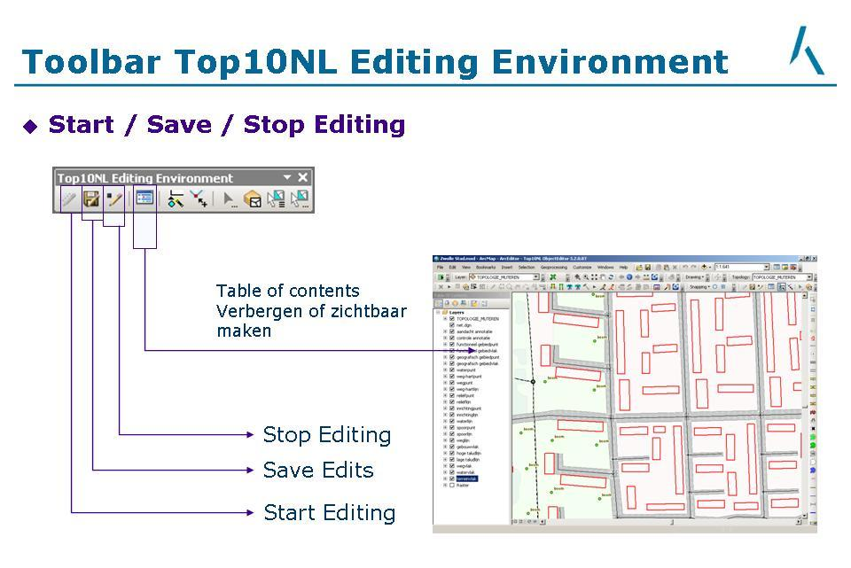

### Instellingen
Voor je begint met objecten bewerken is het verstandig enkele dingen in te stellen, zie hiervoor [Instellingen](Arc-Map/Instellingen.htm).

### Voortgang

|     |     |
| --- | --- |
| 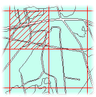 | De voortgang kun je bijhouden door het plaatsen van een voortgangsgrid. In tegenstelling tot vroeger wordt je voortgangsgrid niet meer opgeslagen in het mapdocument (mxd bestand) maar in de database. Bij een reset_mxd ben je dan ook niet meer je voortgangsgrid kwijt. De voortgang is beschikbaar zolang je WMX job bestaat. Een grid bestaat uit meerdere cellen, die elk afzonderlijk gemarkeerd kunnen worden als zijnde 'gereed'. Tijdens het wijzigen van de status van een cel wordt de gewijzigde status in de database opgeslagen. Voor het beheren van de voorgang zijn speciale tools aanwezig in een toolbar. |

#### Voortgangsgrid aan- aan en uitzetten

|     |     |     |
| --- | --- | --- |
| 1   | Klik de knop _Voortgang: grid aan- en uitzetten_ |  |
| 2   | Klik de knop _Voortgang Aoi grid aan/uit_: hiermee toon je het grid. Nog één keer data op de knop maakt het grid onzichtbaar. Deze valt precies binnen de AOI. | 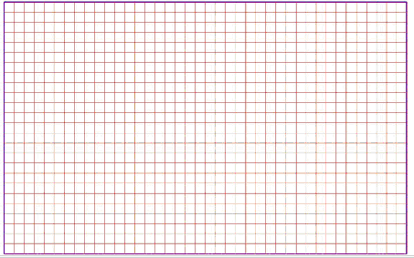 |

#### Status van een grid cel wijzigen

|     |     |     |
| --- | --- | --- |
| 1   | Klik de knop Voortgang: gereed | 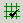 |
| 2   | Klik in een cel om de status te wijzigen in 'gereed' | 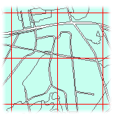 →  |
| 3   | Nogmaals klikken in de cel wijzigt de status weer in 'niet gereed' |  →  |
| 4   | Tijdens het wijzigen van een cel wordt wordt de status in de database opgeslagen middels een automatische save. | |
| 5   | Als je een groep gridcellen gereed wilt maken 'trek' je een kader over deze lege gridcellen. Gereedmeldingen ongedaan maken doe je door weer een data te geven op de cel of cellen | 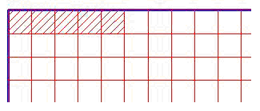 |

### Bewerken
Het bewerken van deTOP10NL kent verschillende stadia. Klik op de desbetreffende button voor meer informatie. 
Zie hiervoor de [Online Trainingen](Trainingen/Trainingen.html).

### Opslaan
Voor het opslaan van wijzigingen zie: 

### Controleren & Valideren
Er zijn hiervoor handleidingen beschikbaar zoals: [Nabewerken](https://hetkadaster.sharepoint.com/sites/gd-odr/1e20b/Topografie/handleidingen/1-Processtappen%20TOP10NL/Actueel/5-Nabewerken) en [Validaties en Gaten](https://hetkadaster.sharepoint.com/sites/gd-odr/1e20b/Topografie/handleidingen/1-Processtappen%20TOP10NL/Actueel/7-Validaties%20en%20gaten).

#### Query & Browse:
Query&Browse is een tool voor het opsporen van fouten ten behoeve van het validatieproces.

De Query & Browsetool is beschikbaar via  op de Toolbar [TOP10NL Validate](Toolbars/TOP10NL_Validate.html).

Deze tool en de bijbehorende queries zijn een samenvoeging van de bestaande Query & Browse en zelfontwikkelde nabewerkingscontroles welk speciaal zijn ontwikkeld voor het validatie proces en aangepast voor het verwerken van herzieningsmutaties volgens het Lean proces.

|     |     |
| --- | --- |  
| 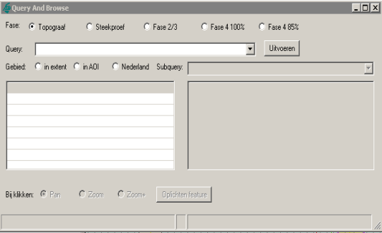 | Na het klikken op het toolbaricoontje  verschijnt het volgende scherm. |
| 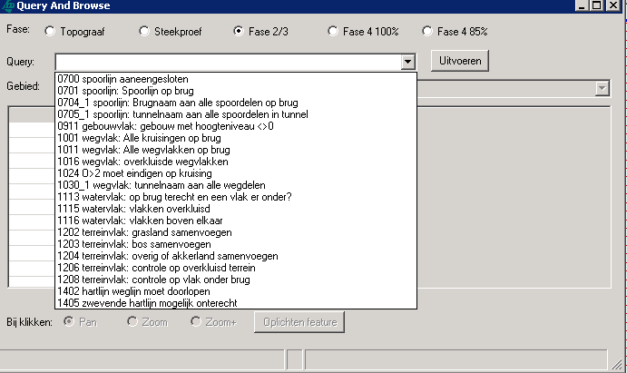 | Als eerste dient de fase gekozen worden. Na het klikken op het selectiepijltje in het Query-veld wordt de lijst geopend met voorgedefinieerde queries . |
| 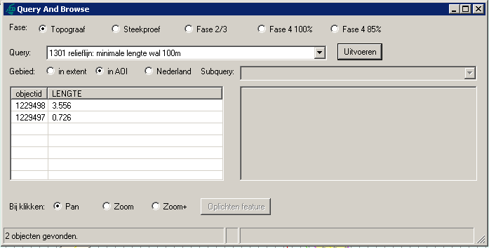 | Nadat de gewenste query is geselecteerd kan de query middels de Uitvoeren-knop gestart worden. Het resultaat van de query wordt in het resultaatveld getoond. |
| 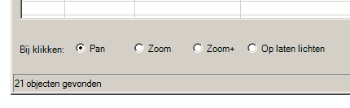 | De gebruiker kan nu op deze resultatenklikken. Afhankelijk van de gekozen actie onderin het scherm zal de applicatie nu naar het gekozen object Pannen, inzoomen (Zoom) of inzoomen met een randje erom heen (Zoom+). |
| 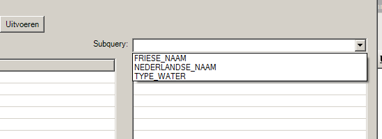 | Voor sommige queries zijn ook subqueries gedefinieerd. Na het klikken op het pijltje in het subqueryveld wordt de lijst met subqueries getoond. |
| 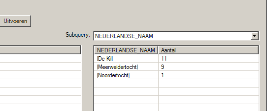 | Na geklikt te hebben op de subquery verschijnt het resultaat in het resultaatveld eronder . |

#### Valideren
Zodra je wijzigingen aanbrengt aan objecten moet je een keer valideren.

Je mag ten alle tijden tussentijds valideren, maar om je taak af te ronden moet je valideren en mogen er geen attribuutfouten en topologiefouten meer aanwezig zijn.

> Bij validaties mag geen gebruik gemaakt worden van de mapcache.

Wordt toch de mapcache voor validaties gebruikt dan is de kans groot dat het validatieproces niet de volledige lijst met gevonden fouten toont

Valideren bestaat uit 2 delen:

1. [Attribuut](Trainingen/Controle_en_Validatie/AttribuutValidaties.pdf), zie hiervoor ook [Attributen valideren](Toolbars/TOP10NL_Validate.html#attributen-valideren)
2. [Topologievalidatie](Trainingen/Controle_en_Validatie/TopologyValidaties.pdf), zie hiervoor ook [Topologie valideren](Toolbars/TOP10NL_Validate.html#topologie-valideren).

> Zodra je een object wijzigt, vorm of attribuut, moet je opnieuw valideren.

### Data toevoegen
In ArcMap is het mogelijk data/layers toe te voegen m.b.v. van de standaard Add Data 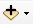 button.

Het tijdelijk toevoegen van BRT-bladwijzers (*.lyr bestand) zijn in het volgende pad te vinden: 

[P:\\Sector\_Voorbewerking\\Bladwijzers\\\_Layers\_Bladwijzers\_BRT\](file:///P:/Sector_Voorbewerking/Bladwijzers/_Layers_Bladwijzers_BRT/bladwijzer_10000.lyr)
