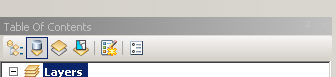
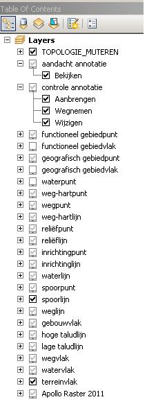
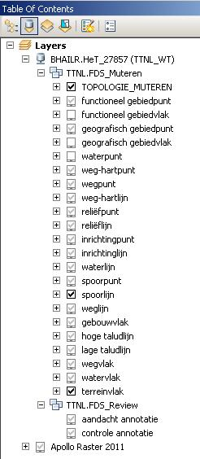
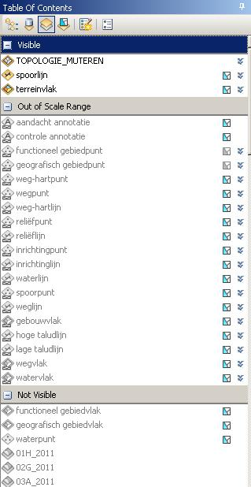
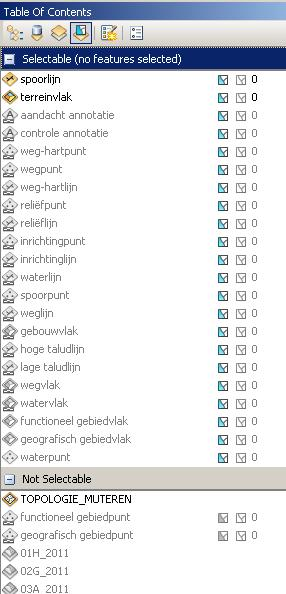
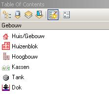
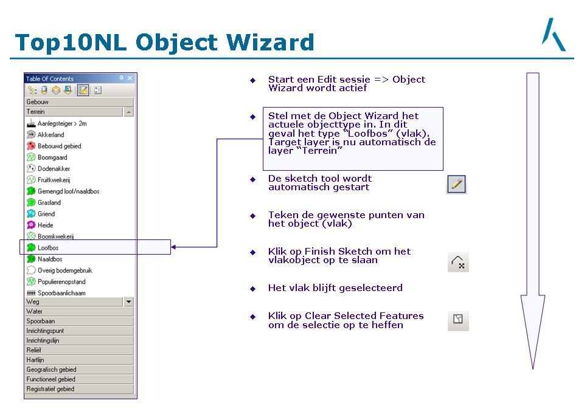
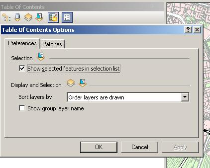

Table of Contents
=================

De toolbar kent 6 buttons. Vijf van die buttons staan uitvoerig beschreven inde on-line Help van ArcGIS.

De Button 'Object Wizard' is geen standaard ArcGis-functionaliteit. 
Deze button is een maatwerkbutton voor het toevoegen van Top10NL-objetcen overeenkomstig de daarvoor opgestelde eisen. 
Klik op de link bij de beschrijving voor de het specifiek gebruik van deze button.

De buttons zijn van links naar rechts (klik op de down-arrow om een afbeelding zichtbaar te maken):

## List By Drawing Order
Gebruik List By Drawing Order om de inhoud van je kaart beheren, zoals de volgorde lagen, het aanmaken van groepslagen of het hernoemen of verwijderen van lagen. 

## List By Source
Gebruik List By Source om de databron van iedere laag zichtbaar te maken. 

## List By Visibility
Gebruik List By Visibility om aan te geven welke laag op deze schaal zichtbaar is voor de gebruiker en welke niet. 

## List By Selection
Gebruik List By Selection om aan te geven hoeveel objecten per datalaag zijn geselecteerd.

## Object Wizard
Gebruik de Object Wizard voor het invoeren van nieuwe objecten in Top10NL. Dit is een maatwerktoevoeging aan de Table of Contents Toolbar. 

Zie voor een korte beschrijving: 

Zie ook de pagina over de [Object Wizard](../../../Trainingen_en_Voorbeelden/Object_Wizard/Object_Wizard.html) voor een uitgebreide beschrijving.

## Options
Klik de Options-button om de eigenschappen van de Table of Content aan te passen.

