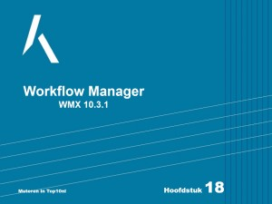
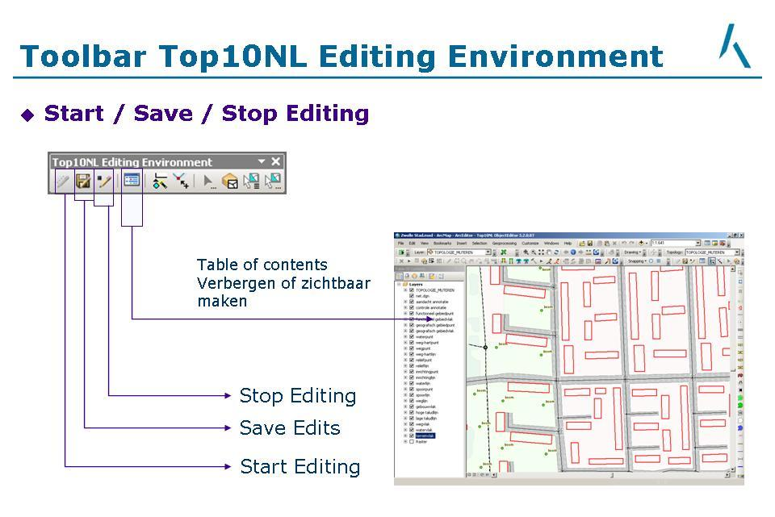

Workflowmanager
===============

Dit onderdeel van Workflow Manager is nieuw en zal later aangevuld worden. 
Kijk onderstaand filmpje (presentatie) over het gebruik van de Workflow Manager Extension (WMX).

 
Klik op bovenstaand plaatje om de presentatie te bekijken.

Nadat vanuit de Workflow Manager Extension een job is opgestart dient de gebruiker eerst een edit-sessie te starten om wijzigingen aan te kunnen brengen. 
Een overzicht van de start- en stopknoppen in ArcGIS: 

