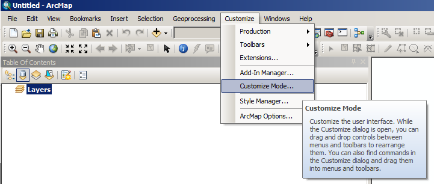
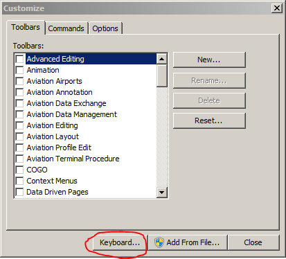
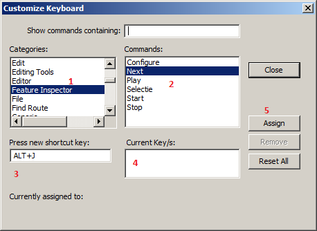
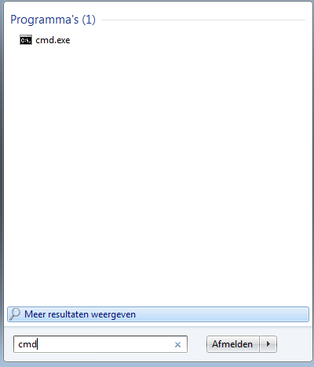
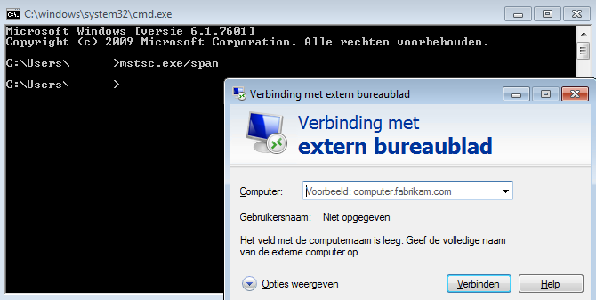
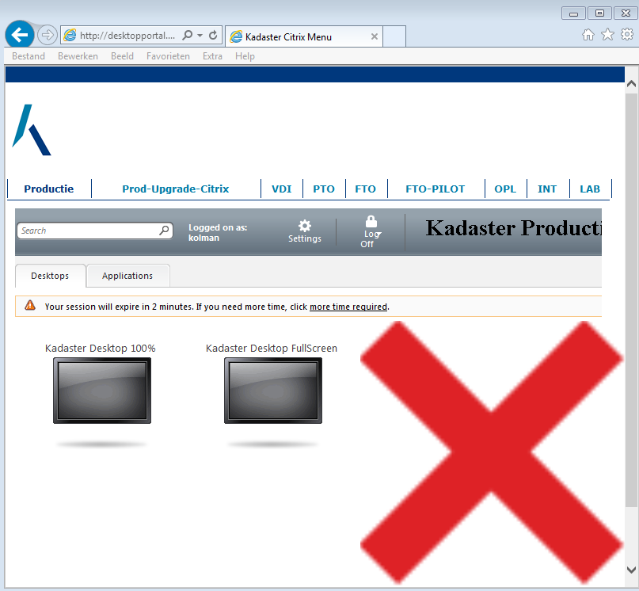
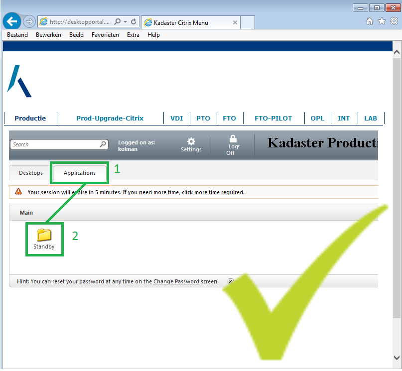
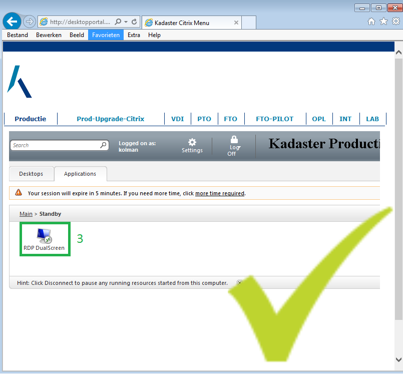
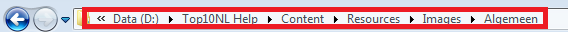

Tips en Tricks
==============

Hieronder een aantal verschillende wetenswaardigheden voor alles wat met het werk te maken kan hebben.

> **Let op:** 
> Handige tips en tricks die het werk- of gebruiksgemak kunnen vergroten zijn altijd welkom. 
> Heb je een link of handigheid waar je collega's hun voordeel mee zouden kunnen doen? 
> Stuur deze dan naar dpi-gi@kadaster.nl

### Aandacht- en controle-annotaties
Wanneeer één van de maatwerk-annotatie-functies (Aandacht: Bekijken, Controle: Aanbrengen, Controle: Wijzigen of Controle: Wegnemen) vanuit een andere toolbar dan de TOP10NL Review-toolbar start kan bij het plaatsen van aandacht- of controle-annotaties de volgende foutmelding verschijnen: 

Je mag uiteraard de icoontjes in een andere toolbar plaatsen, maar de software vereist dat de TOP10NL Review-toolbar geopend is bij het starten van een maatwerk-annotatie. 

Anders verschijnt een enigszins cryptische foutmelding.

### Editen met/zonder Templated Features
Bij het editen in TOP10NL is het verstandig om ervoor te zorgen Templated Features "uit" staat. Als deze namelijk "aan" staat, werken sommige maatwerk-buttons niet, bijvoorbeeld "buffer + densify". 
Het wijzigen van deze setting heeft alleen effect ArcMap-sessies die daarna gestart worden. Dus een eventueel lopende ArcMap-sessie afsluiten en opnieuw starten.

**Op een PC (Fat Cliënt) gaat dit als volgt:**

|     |     |     |
| --- | --- | --- |
| 1   | Open je verkenner en browse naar C:\\Program Files (x86)\\Kadaster\\Top10NL\\Editor\\ Klik op het pijltje naast Type en klik op Toepassing in het contextmenu Je krijgt nu alleen in de map de applicaties te zien. |  |
| 2   | Dubbelklik op Top10NL.SettingsManager Het TOP10NL SettingsManager-dialoogscherm opent zich. |  |
| 3   | Controleer of de checkbox bij Templated editing toestaan uitgevinkt is Is dat het geval, klik dan op Sluiten  Is dat niet het geval, vink het dan uit en klik op Opslaan Je krijgt dan een warning in beeld |  |
| 4   | Dit is een schoonheidsfoutje in de maatwerk-software. Klik op Ja. Je valt terug in het TOP10NL SettingsManager-dialoogscherm. |  |
| 5   | Klik op Sluiten |  |
| 6   | Als Templated editing toestaan al uitgevinkt staat in dit dialoogscherm, kan het voorkomen dat het in ArcMap toch nog aanstaat. Dit kan je als volgt controleren: open je verkenner en browse naar C:\\Program Files (x86)\\ArcGIS\\Desktop&lt;versienummer&gt;\\Editor\\Utilities&lt;versienummer&gt; bijvoorbeeld 10.3 van de geïnstalleerde ArcGIS versie en dubbelklik AdvancedArcMapSettings |  |
| 7   | Het ArcMap Advanced Settings Utility-dialoogscherm opent zich. Controleer of de checkbox bij Create features using templates uitgevinkt is. Is dat het geval, klik dan op Close.  Is dat niet het geval, vink het dan uit en klik achtereenvolgens op Apply en Close. |  |

**In Werkplek 2.0 (de cloud) gaat het op een iets andere manier.**

|     |     |     |
| --- | --- | --- |
| 1   | Selecteer in de ArcGIS-cloud omgeving BRT File Explorer en klik op Openen.  Een verkenner wordt geopend. Dit duurt even (Starting…) |  |
| 2   | Klik in de balk (zodat This PC geselecteerd wordt) en typ C: &lt;enter&gt; Je ziet nu je C-drive van je cloud-omgeving. This PC > Windows (C:) |  |
| 3   | Browse verder naar C:\\Program Files (x86)\\Kadaster\\Top10NL\\Editor\ Klik op het pijltje naast Type en klik op Toepassing in het contextmenu |  |
| 4   | Nu kan je dubbelklikken op de applicatie Top10NL.SettingsManager Het TOP10NL SettingsManager-dialoogscherm opent zich. |  |
| 5   | Controleer of de checkbox bij Templated editing toestaan uitgevinkt is Is dat het geval, klik dan op Sluiten Is dat niet het geval, vink het dan uit en klik op Opslaan Je krijgt dan een warning in beeld |  |
| 6   | Dit is een schoonheidsfoutje in de maatwerk-software. Klik op Ja. Je valt terug in het TOP10NL SettingsManager-dialoogscherm. |  |
| 7   | Klik op Sluiten |  |
| 8   | Als Templated editing toestaan al uitgevinkt staat in dit dialoogscherm, kan het voorkomen dat het in ArcMap toch nog aanstaat. Dit kan je als volgt controleren: Ga terug naar This PC > Windows (C:) > Program Files (x86) en browse van daaruit naar ArcGIS\\Desktop&lt;versienummer&gt;\\Editor\\Utilities&lt;versienummer&gt; bijvoorbeeld 10.6 van de geïnstalleerde ArcGIS versie en dubbelklik AdvancedArcMapSettings |  |
| 9   | Het ArcMap Advanced Settings Utility-dialoogscherm opent zich. Controleer of de checkbox bij Create features using templates uitgevinkt is. Is dat het geval, klik dan op Close. Is dat niet het geval, vink het dan uit en klik achtereenvolgens op Apply en Close. |  |
| 10  | Tenslotte kan je de verkenner weer sluiten. |  |

### Sneltoetsen Feature Inspector
Onder de gebruikers van de Feature Inspector is er behoefte aan een sneltoets om snel en makkelijk door de objecten in de lijst te kunnen bewegen. Hier is geen standaardsneltoets voor geprogrammeerd, maar het is relatief eenvoudig om zelf een sneltoets van voorkeur in te stellen hiervoor.

Hieronder een uitwerking van de oorspronkelijke uitleg van ArcGIS 10.3 [zoals hier te lezen](http://desktop.arcgis.com/en/arcmap/10.3/guide-books/customizing-the-ui/assigning-a-shortcut-key.htm).

In het voorbeeld wordt de functie next (volgende feature) gekoppeld aan de sneltoetscombinatie ALT + J.

|     |     |     |     |
| --- | --- | --- | --- |
| 1   |     | Ga in het menu via **Customize** naar **Customize Mode**. |  |
| 2   |     | Klik op de knop **Keyboard**. |  |
|     | 1   | Stel de sneltoetscombinatie in: Selecteer eerst bij **Categories** de categorie **Feature Inspector**. |  |
|     | 2   | Vervolgens selecteer je de functie waarvoor je een sneltoets wil instellen bij **Commands**. |
|     | 3   | Een sneltoets is vaak een combinatie van SHIFT, CTRL of ALT plus een letter. Druk beide toetsen tegelijk in om de keuze in te stellen. |
|     | 4   | Als de sneltoetscombinatie al in gebruik is voor een andere tool dan verschijnt dat bij het kopje **Currently assigned to**. |
|     | 5   | Als de sneltoetscombinatie nog vrij is kan deze met een druk op de knop **Assign** worden vastgelegd. |

Herhaal dit voor alle sneltoetsen die je wilt instellen.

### Customizen van je werkbalken
Er zijn veel handigheidjes te behalen door het customizen van je werkbalken. 
Lees daarover in [Toolbars en contextmenu's aanpassen](../Arc-Map/Toolbars.htm#ToolbarsContextmenu'sAanpassen).

### Remote werken met Dual screen
Als je vanuit thuis, Citrix of elders verbind komt het scherm vaak op een enkel scherm, ondanks dat naamgeving van de applicatie anders impliceert. 
Om toch remote te connecten en gebruik te maken van twee schermen kan je het volgende doen:

|     |     |
| --- | --- |
| Zoek in het startmenu naar het programma 'cmd' en voer deze uit. |  |
| Voer 'mstsc.exe/span' en voer deze uit.  Hierna verschijnt het verbindingsscherm zoals je gewend bent. |  |

### Remote inloggen met zo min mogelijk vertraging

|     |     |
| --- | --- |
| Vanuit huis kan verbinding worden gelegd met het kadaster netwerk via de Desktop Portal. Dan kan je de Citrix omgeving in, en van daaruit de Remote Desktop opstarten. Dit kan zorgen voor een trage verbinding en daarmee een trage, vervelende manier van werken. |  |
| Dat kan je omzeilen door na het inloggen op 'Applications' (1) te klikken. vervolgens de map 'Standby' (2) openen ... |  |
| en tenslotte 'RDP Dualscreen' (3) te starten. Hierdoor sla je Citrix over, heb je een snellere verbinding. |  |

### Files met een te lange padnaam verwijderen
In het kort:

|     |     |
| --- | --- |
| 1   | Je constateert dat een bestand niet verwijderd kan worden kijkt of het bestand een lange padnaam heeft. Het padnaam zie je in de verkenner:  |
| 2   | Navigeer naar een aantal lagen boven het betreffende bestand. |
| 3   | Cut + Paste naar een locatie met een minder lange padnaam. |
| 4   | Verwijder het bestand. |

Sinds de samenwerking met CapGemini is er een probleem ontstaan bij bestanden die erg diep in een mappenstructuur opgeslagen liggen. 
Je kan een map (die submappen met daarbinnen submappen binnen submappen etc. bevat) kopieren naar een andere locatie die een langer pad in de verkenner tot resultaat heeft.

Als je een backup maakt van een map, kopieer je die bv. van D:\\TOP10NL Help naar bv. U:\\OfficeserverL-Z\\MB-GEO-PPB\\TOP10NL\\TOP10NL Help\\Backups TOP10NL Help. 
Dit heeft een langere padnaam.

De map die je gekopieerd heb kan bestanden bevatten, waardoor dierper gelegen bestanden een erg lange padnaam kunnen opleveren. 
Dit kan zo'n lang pad opleveren dat wanneer je de oorspronkelijke map sinds de overgang probeert te verwijderen hij het gros gewoon verwijderd, maar bestanden met een erg lange padnaam niet kan verwijderen.

Hier is geen oplossing voor en ook CapGemini heeft in het verleden hierover gemeld dat ze hier niets aan kunnen doen. 
Er is echter een simpele workaround.

Een map die niet verwijderd kan worden die bijvoorbeeld onder 20 andere mappen ligt kan namelijk met Cut + Paste verplaatst worden naar een locatie met een kortere padnaam. 
In de praktijk komt dit erop neer dat je de map die de onderste 5 van de 20 lagen bevat kan Cut + Pasten naar een map die 5 lagen hoger ligt. 
Hierna ligt het bestand nog maar 15 lagen diep in plaats van 20. Dit kan je enkele malen achter elkaar doen, waarna de totale padnaam een stuk korter wordt en het bestand alsnog verwijderd kan worden.
