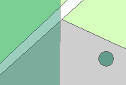

Functioneel gebied
==================

## Definitie

Begrensd en benoemd gebied dat door een functionele eenheid beschreven wordt.

## Functionele gebiedsvlakken en gebiedspunten

|     |     |
| --- | --- |
|  | Functioneel gebiedsvlak |
|  | Functioneel gebiedspunt |

Functionele gebiedspunten zijn ontstaan tijdens de conversie van de namen in TOP10vector. Deze punten zullen tijdelijk bestaan. 
Functionele gebiedsvlakken liggen bovenop alle overige objecten.

## Attributen en attribuutwaarden

De attributen attribuutwaarden van Functioneel gebied zijn te vinden in de [BRT: Catalogus en Productspecificaties](https://kadaster.github.io/imbrt/#512-functioneel-gebied).
