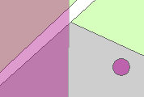

Geografisch gebied
==================

## Definitie

Begrensd en benoemd gebied dat door een geografische eenheid beschreven wordt.

## Geografische gebiedsvlakken en gebiedspunten

|     |     |
| --- | --- |
|  | Geografisch gebiedsvlak |
|  | Geografisch gebiedspunt |

Geografische gebiedspunten zijn ontstaan tijdens de conversie van de namen in Top10Vector. Deze punten zullen tijdelijk bestaan. 
Geografische gebiedsvlakken liggen bovenop alle overige objecten.

## Attributen en attribuutwaarden

De attributen attribuutwaarden van Geografisch gebied zijn te vinden in de [BRT: Catalogus en Productspecificaties](https://kadaster.github.io/imbrt/#510-geografisch-gebied).
