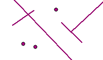

Inrichtingselement
==================

## Definitie

Ruimtelijk object, al dan niet ter detaillering dan wel ter inrichting van de overige benoemde ruimtelijke objecten of een ander inrichtingselement.

## Inrichtingslijnen en inrichtingspunten

|     |     |
| --- | --- |
|  | Inrichtingslijn |
|  | Inrichtingspunt |

Inrichtingslijnen hebben geen hartlijnen.

## Vlakscheidend

De volgende inrichtingslijnen zijn vlakscheidend: 
attribuut _type inrichtingselement_ =
- aanlegsteiger
- dam/koedam
- geluidswering
- hekwerk
- kogelvanger schietbaan
- laadperron
- muur
- paalwerk
- sluisdeur
- stormvloedkering
- strekdam, krib, golfbreker
- stuw
- tol
- verkeersgeleider
- wegafsluiting
- overig
- onbekend

Vlakscheidend betekent dat als er een lijnobject een wegvlak, terreinvlak of watervlak doorsnijdt dat het vlak geknipt moet worden op de plaats van de lijn(en).

|     |     |     |     |
| --- | --- | --- | --- |
|           | → |           | 1 waterlijn doorsnijdt een terreinvlak |
|         | → |         | 2 waterlijnen tezamen doorsnijden een terreinvlak |
|  | → |  | 3 waterlijnen tezamen doorsnijden een terreinvlak |

Het vlak wordt niet opgedeeld als vlakscheidende lijn gedeeltelijk in het terreinvlak steekt: 

Het is niet toegestaan dat een vlakscheidende lijn gedeeltelijk in een wegvlak steekt: 

## Attributen en attribuutwaarden

De attributen attribuutwaarden van Inrichtingselement zijn te vinden in de [BRT: Catalogus en Productspecificaties](https://kadaster.github.io/imbrt/#56-inrichtingselement).
