TOP10NL Objecten
================

TOP10NL is de opvolger van Top10Vector en heeft een objectgerichte structuur.

Uit de lijnen, symbolen en teksten van TOP10Vector worden eenmalig objecten gevormd m.b.v. [FME (Feature Manipulation Engine)](#fme) en opgeslagen in een [Oracle 9i Spatial database](#oracle).

Deze database noemen we de **TOP10NL kerndatabase** en bevat alle objecten van geheel Nederland zonder bladgrenzen.

Objecten in de kern worden nooit rechtstreeks door een gebruiker bewerkt. Het onderhoud op de objecten gebeurt in een aparte database, de zgn. **TOP10NL werkdatabase**. Deze werkdatabase, ook in Oracle, heeft een structuur die geschikt is om met ArcMap te bewerken. [ArcMap](#arcmap) praat niet rechtstreeks met de werkset maar via een tussenlaag, ArcSDE genaamd.

Het bijwerken van TOP10NL gebeurt volgens de vastgestelde workflow die m.b.v. WMX wordt beheerd.

Van een object kun je de attributen, geometrie of klasse wijzigen, zie hiervoor [Voorbeelden van eenvoudige situaties](Voorbeelden_eenvoudig/Voorbeelden_eenvoudig.html).

### FME
 
**FME**, de Feature Manipulation Engine, is een product dat ontwikkeld wordt door het Canadese bedrijf SAFE. Het is uitermate geschikt voor het converteren van GIS-data tussen een groot aantal verschillende bestandsformaten. Ook is het mogelijk allerlei bewerkingen op de data uit te voeren zodat het pakket ook voor voorbewerking gebruikt kan worden. Opvallende kenmerken van FME zijn de grote hoeveelheid formaten die het aankan, de snelheid waarmee het werkt en de uitgebreide mogelijkheden tot het fine-tunen van een conversie via de zogenaamde transformers.

FME is beschikbaar in een aantal verschillende versies:
- Basisproducten (Windows)
- FME Desktop: de basisversie van FME
- Premium producten (Windows)
- FME Professional Een meer uitgebreide versie van FME met ondersteuning voor meer formaten. Ondersteunt ook standaard coördinaatconversie
- FME voor ESRI Geoptimaliseerd voor het verwerken van ESRI SDE data
- FME voor Intergraph Geoptimaliseerd voor het werken met GeoMedia
- FME voor Oracle Kan overweg met Oracle databases
- FME voor Smallworld Geoptimaliseerd voor het verwerken van Smallworld data

### Oracle
 
**Oracle** is een bedrijf en merknaam. Oracle Spatial is een extensie van de Oracle database die de mogelijkheid biedt om ruimtelijke data in een database vast te leggen, te muteren en te bevragen.

Oracle Spatial bestaat uit de volgende componenten:
- Een schema in de database, waarin geometrische datatypes kunnen worden vastgelegd;
- Een indexmechanisme om ruimtelijke data te kunnen indexeren;
- Een set van operators en functies om ruimtelijke queries en analyses te kunnen uitvoeren.
- Oracle Spatial kan ruimtelijke gegevens integreren met administratieve gegevens uit dezelfde of andere databases.

### ArcMap
 
**ArcMap** is de centrale applicatie in ArcGIS Desktop. 
Kaart-geöriënteerde handelingen, zoals editen, analyseren en het maken van cartografische producten, staan centraal in deze applicatie.

## Objectklasse

TOP10NL bevat objecten die zijn opgeslagen in een database. Deze objecten hebben identificerende, temporele, meta en beschrijvende kenmerken, die als attributen zijn opgenomen.

De vorm van een object wordt vastgelegd met drie basisvormen: de punt, de rechte lijn en het door rechte lijnen begrensde vlak. In een tabel is aangegeven op welke wijze de objecten geometrisch kunnen worden afgebeeld: 
**Geometrische afbeelding**

| Entiteit            | Vlak | Lijn | Punt |
| ---                 | ---  | ---  | ---  |
| Wegdeel *           | X    | X    | X    |
| Spoorbaandeel *     | X    | X    | X    |
| Waterdeel *         | X    | X    | X    |
| Gebouw              | X    |      |      |
| Terrein             | X    |      |      |
| Inrichtingselement  |      | X    | X    |
| Registratief gebied | X    |      |      |
| Geografisch gebied  | X    |      |      |
| Functioneel gebied  | X    |      |      |

\* Wegdeel, spoorbaandeel en waterdeel kunnen ook 'lijn' in de betekenis van verbindingslijn of 'punt' in de betekenis van knooppunt als geometrische afbeelding hebben.

## Definitie en basisvormen

Entiteit met status, gedrag, en identiteit.

De basisvormen voor het vastleggen van de vorm van objecten zijn: 
punt: 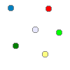, 
lijn: 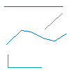 en 
vlak: 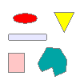.

## Soorten Objectklassen

Zowel de kerndatabase als de werkdatabase kennen de volgende objectklassen:
- [Functioneel gebied](Functioneel_gebied.html)
- [Gebouw](Gebouw.html)
- [Geografisch gebied](Geografisch_gebied.html)
- [Inrichtingselement](Inrichtingselement.html)
- [Registratief gebied](Registratief_gebied.html)
- [Reliëf](Relief.html)
- [Spoorbaandeel](Spoorbaandeel.html)
- [Terrein](Terrein.html)
- [Waterdeel](Waterdeel.html)
- [Wegdeel](Wegdeel.html)

## Uniek objectnummer

Elk object heeft een uniek nummer, ook wel ID genoemd. 
In de kerndatabase hebben alle objecten een uniek TOP10NL-ID, terwijl in de werkdatabase alle objecten een uniek Object-ID hebben en niet perse een TOP10NL-ID hoeven te hebben. 
TOP10NL-ID's worden uitgedeeld als een kopie van een object uit de werkdatabase naar de kerndatabase wordt gebracht. 
ArcMap zorgt er automatisch voor dat elk object in de werkdatabase wordt voorzien van een unieke Object-ID.

### TOP10NL-ID
Het TOP10NL-ID wordt uitgedeeld door de **kern**database. 
Nieuwe objecten in de **werk**database krijgen geen TOP10NL-ID, pas als het wordt gekopieerd naar de **kern**database wordt het bijgewerkt. 
Ook als het object vanuit de kerndatabase naar de **werk**database wordt gekopieerd is het gevuld.

### Object-ID
Alleen in de **werk**database hebben objecten een Object_Id. 
Het Object_Id wordt door ArcMap uitgedeeld als het object uit de **kern**database wordt gekopieerd of als het als nieuw object wordt gedigitaliseerd.

In het attribuutvenster is het TOP10NL-ID en het Object_Id zichtbaar. 
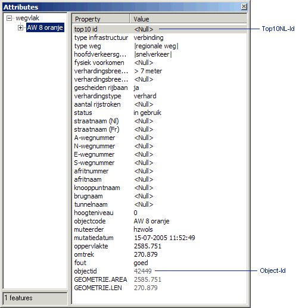

## Attributen

Elk object heeft attributen, zowel in de **werk**database als in de **kern**database. 
In beide databases hebben ze een aantal attributen hetzelfde, maar in de **werk**database hebben objecten meer kenmerken zoals oppervlakte, lengte, muteerder en mutatiedatum. 
Een attribuut is optioneel of verplicht:
- Optioneel betekent dat het attribuut een waarde _mag_ hebben.
- In de **kern**database heeft een object dan niet dat attribuut, in de **werk**database heeft het attribuut dan de waarde &lt;Null&gt;.
- Een optioneel attribuut bij een wegdeel is bijvoorbeeld de straatnaam. Verplicht betekent dat het attribuut een waarde moet hebben. In de **werk**database mag dat attribuut dan niet de waarde &lt;Null&gt; hebben.
- Een verplicht attribuut bij alle terrein is bijvoorbeeld _type landgebruik_.

### Toelichting attributen
Elk object in de werkdatabase van TOP10NL heeft attributen. Objecten in dezelfde objectklasse hebben hetzelfde aantal attributen.

In het attribuutvenster van ArcMap een voorbeeld van de attributen van een wegvlak in de werkdatabase: 

In het venster zie je voorbeelden van enkelvoudige, meervoudige, optionele, verplichte en niet te wijzigen attributen.

## Attribuutwaarden

Sommige attributen kunnen maar één attribuutwaarde hebben, terwijl andere attributen meerdere waarden mogen hebben. 
We spreken hier van enkelvoudige en meervoudige attributen. 
Een wegdeel kan bijvoorbeeld meerdere straatnamen hebben en maar één hoogteniveau. 
In de **werk**database worden meerdere attribuutwaarden gescheiden door het '|' (pipe) teken. 
De vulling van _type gebouw_ kan er bijvoorbeeld zo uit zien: 
**_"|huizenblok|postkantoor|politiebureau|"_**.

## Geometrie

In de **kern**database hebben wegdelen vaak een meervoudige geometrie. Deze geo-objecten (uitgezonderd wegdelen met hoofdverkeersgebruik 'parkeren', 'parkeren: P+R parkeerplaats' en 'parkeren: carpoolplaats') hebben namelijk een hartlijn-geometrie in de vorm van een lijn (bij verbindingen) of punt (bij kruisingen). 
Vlakvormige wegdelen kunnen overigens ook wegkanten hebben. Deze zijn nodig voor de visualisatie van parallelle wegen, middellijnen en de wegcontouren op kruisingen.

Ook sommige reliëfobjecten hebben een meervoudige geometrie. Dit geldt voor het type reliëf 'talud, hoogteverschil' en 'steile rand, aardrand'. Deze reliëfobjecten hebben een lijn die de hoge kant aangeeft en een lijn die de lage kant aangeeft.

De registratieve gebieden, geografische gebieden en functionele gebieden kunnen bestaan uit meerdere vlakken. Deze behoren tot hetzelfde gebied met een bepaalde naam. Denk hierbij bijvoorbeeld aan de gemeente Amsterdam die bestaat uit twee vlakken.

In de **werk**database hebben objecten maar 1 geometrie. Om aan te geven dat bijvoorbeeld een wegvlak, een hartlijn en wegkanten bij elkaar horen worden ze via een relatie gekoppeld (gelinkt). Objecten koppelen d.m.v. een relatie doe je met de tool [Geometry Linker](../../Esri_ArcGIS/ArcMap/Toolbars/Toolbars.html#geometry-linker).

### Objectrelatie
Voorbeeld van een relatie tussen een wegvlak en hartlijn getoond in het attribuutvenster: 
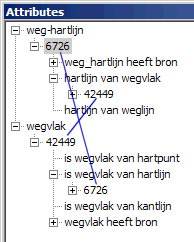

|     |     |     |     |
| --- | --- | --- | --- |
| objectklasse in kern | geometriesoort     | objectklasse in werk | soort geometrie |
| wegdeel              | punt + lijn + vlak | wegpunt              | punt |
|                      |                    | weglijn              | lijn |
|                      |                    | wegvlak              | vlak |

Een geometrie kan wel uit meerdere delen bestaan, maar worden wel als 1 geometrie gezien. In ArcGis wordt hiervoor de term 'multi-part' gebruikt. Alleen objecten van de types registratieve gebied, geografische gebied en functionele gebied mogen 'multi-part' zijn.

## Landsdekkend

Wegvlakken: 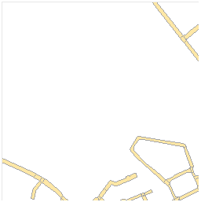 , 
terreinvlakken: 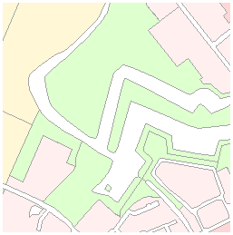 en 
watervlakken 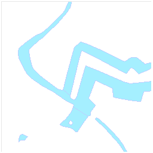 , 
behoren gezamenlijk aanééngrenzend en landsdekkend te zijn 
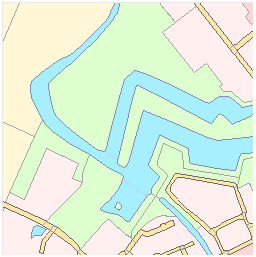.

Er behoren geen zgn. 'witte' gebieden te zijn: 

Een aantal registratieve gebieden, zoals provincies en gemeenten, grenzen aan elkaar en zijn landsdekkend.

De functionele en geografische gebieden zijn niet landsdekkend.

## Overlappend

Bovenop de landsdekkende wegvlakken, terreinvlakken en watervlakken liggen gebouwen: 
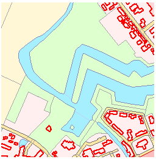

evenals:
- reliëflijnen
- weglijnen
- waterlijnen en punten
- inrichtingslijnen en punten
- spoorlijnen en punten

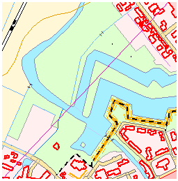 
Gebouwen maken dus geen deel uit van het terrein

Bovenop de wegvlakken en weglijnen liggen: 
wegpunten, hartlijnen en hartpunten: 
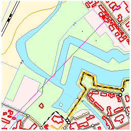

Vlakken mogen elkaar niet overlappen indien de waarde van het attribuut _hoogteniveau_ van betrokken objecten gelijk is:

|     |     |
| --- | --- |
| 2 overlappende wegvlakken.          | 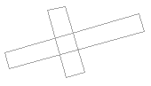 |
| Een wegvlak overlapt terreinvlak.   | 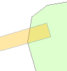 |
| Een terreinvlak overlapt watervlak. | 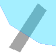 |

Ook mag een gebouw niet zomaar een wegvlak of watervlak overlappen zonder dat het attribuut _fysiek voorkomen_ de waarde 'overkluisd' heeft:

|     |     |     |
| --- | --- | --- |
| 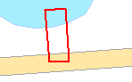 | → | 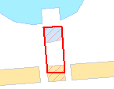 |

Een gebouwvlak overlapt zowel een watervlak als wegvlak. 
Alleen het gedeelte van het waterdeel onder het gebouw krijgt _fysiek voorkomen_ = 'overkluisd', terwijl een groter deel van het wegvlak hetzelfde overkomt.

**Een object dat overkluisd is krijgt hetzelfde hoogteniveau als het gebouw dat er boven ligt.** 
Als het gebouw geen waarde voor het hoogteniveau heeft, dan is het hoogteniveau van het overkluisde geo-object '0'.

Een wegvlak dat een watervlak overlapt mag niet, behalve als de weg _Fysiek voorkomen_='op vast deel van brug' heeft en onder het wegdeel een watervlak met _hoogteniveau_ = '-1' aanwezig is:

|     |     |     |
| --- | --- | --- |
| 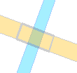 | → | 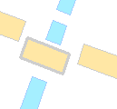 |

Het wegvlak overlapt een watervlak. 
Het wegvlak met _fysiek voorkomen_ = 'op vast deel van brug' valt gedeeltelijk samen met een watervlak dat _hoogteniveau_ = '-1' heeft.

Een terreinvlak mag niet een watervlak overlappen. Een uitzondering geldt voor terreinvlakken van het _type_ = 'aanlegsteiger'. In dat geval mag het wel mits het watervlak _hoogteniveau_ = '-1' heeft:

|     |     |     |
| --- | --- | --- |
| 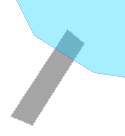 | → | 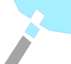 |

Het terreinvlak overlapt het watervlak. 
Het watervlak onder de steiger heeft _hoogteniveau_ = '-1'.

Functionele, geografische en registratieve moet je los zien van alle andere objectklassen. 
De grenzen van de functionele gebieden worden indien mogelijk wel afgestemd met de grenzen van de terreinobjecten. 
De functionele en geografische gebieden kunnen elkaar overlappen.
