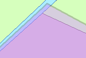

Registratief gebied
===================

## Definitie

Op basis van wet- en regelgeving afgebakend gebied dat als eenheid geldt van politieke/bestuurlijke verantwoordelijkheid of voor bedrijfsvoering.

## Registratieve gebiedsvlakken

|     |     |
| --- | --- |
|  | Registratief gebiedsvlak |

Registratieve gebiedsvlakken liggen bovenop alle overige objecten.

## Attributen en attribuutwaarden

De attributen attribuutwaarden van Registratief gebied zijn te vinden in de [BRT: Catalogus en Productspecificaties](https://kadaster.github.io/imbrt/#59-registratief-gebied).
