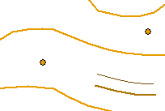
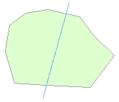
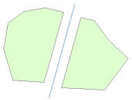
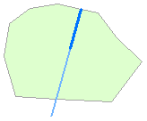
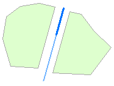
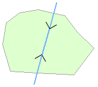
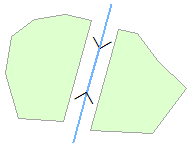
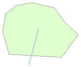
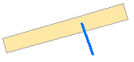

Reliëf
======

## Definitie

Object dat tot doel heeft hoogte te representeren.

## Reliëflijnen, hoge en lage taludlijnen en reliëfpunten

|     |     |
| --- | --- |
|  | Reliëflijn |
|  | Hoge taludlijn |
|  | Hoge taludlijn |
|  | Reliëfpunt |

Reliëflijnen hebben geen hartlijnen. 
Bij elke hoge taludlijn hoort een lage taludlijn.

## Vlakscheidend

Reliëflijnen met attribuut _type reliëf_ = 'steile rand, aardrand' zijn vlakscheidend.

Vlakscheidend betekent dat als er een lijnobject een wegvlak, terreinvlak of watervlak doorsnijdt dat het vlak geknipt moet worden op de plaats van de lijn(en).

|     |     |     |     |
| --- | --- | --- | --- |
|           | → |           | 1 waterlijn doorsnijdt een terreinvlak |
|         | → |         | 2 waterlijnen tezamen doorsnijden een terreinvlak |
|  | → |  | 3 waterlijnen tezamen doorsnijden een terreinvlak |

Het vlak wordt niet opgedeeld als vlakscheidende lijn gedeeltelijk in het terreinvlak steekt: 

Het is niet toegestaan dat een vlakscheidende lijn gedeeltelijk in een wegvlak steekt: 

## Attributen en attribuutwaarden

De attributen attribuutwaarden van Reliëf zijn te vinden in de [BRT: Catalogus en Productspecificaties](https://kadaster.github.io/imbrt/#57-reliëf).
