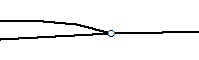
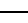
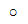

Spoorbaandeel
=============

## Definitie

Kleinste functioneel onafhankelijk stukje spoorbaan met gelijkblijvende, homogene eigenschappen en relaties dat er binnen een spoorwegnet wordt onderscheiden.

## Spoorlijnen en spoorpunten

|     |     |
| --- | --- |
|  | Spoorlijn |
|  | Spoorpunt |

Spoorlijnen hebben geen hartlijnen. 
Daar waar 2 spoorlijnen elkaar snijden hoort een spoorpunt en zijn de lijnen onderbroken.

## Vlakscheidend

Spoorbaandelen met attribuut _type spoorbaan_ = 'trein' of 'metro' zijn vlakscheidend.

Vlakscheidend betekent dat als er een lijnobject een wegvlak, terreinvlak of watervlak doorsnijdt dat het vlak geknipt moet worden op de plaats van de lijn(en).

|     |     |     |     |
| --- | --- | --- | --- |
|           | → |           | 1 waterlijn doorsnijdt een terreinvlak |
|         | → |         | 2 waterlijnen tezamen doorsnijden een terreinvlak |
|  | → |  | 3 waterlijnen tezamen doorsnijden een terreinvlak |

Het vlak wordt niet opgedeeld als vlakscheidende lijn gedeeltelijk in het terreinvlak steekt: 

Het is niet toegestaan dat een vlakscheidende lijn gedeeltelijk in een wegvlak steekt: 

## Attributen en attribuutwaarden

De attributen attribuutwaarden van Spoorbaandeel zijn te vinden in de [BRT: Catalogus en Productspecificaties](https://kadaster.github.io/imbrt/#52-spoorbaandeel).
