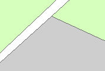

Terrein
=======

## Definitie

Door een landgebruik gekarakteriseerd zichtbaar begrensd stuk grond, niet zijnde weg of water.

## Terreinvlakken

|     |     |
| --- | --- |
|  | Terreinvlakken |

Bovenop een terreinvlak met attribuut _type landgebruik_ = "bebouwd gebied" hoort een [Gebouw](Gebouw.html) met attribuut _type gebouw_ = "huizenblok" te liggen.

## Attributen en attribuutwaarden

De attributen attribuutwaarden van Terrein zijn te vinden in de [BRT: Catalogus en Productspecificaties](https://kadaster.github.io/imbrt/#55-terrein).
