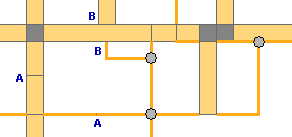
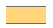
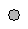
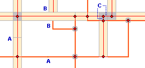
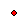
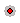

Wegdeel
=======

## Definitie

Kleinste functioneel onafhankelijk stukje weg met gelijkblijvende, homogene eigenschappen en relaties voor wegverkeer en vliegverkeer te land.

## Wegvlakken, weglijnen, wegpunten

Een wegvlak met attribuut type infrastructuur="kruising" noemen we een **kruisingsvlak**. 
Een wegpunt noemen we een **kruisingspunt**.

|     |     |
| --- | --- |
|  | Wegvlak |
|  | Weglijn |
|  | Kruisingsvlak |
|  | Kruisingspunt |

Daar waar 2 wegvlakken elkaar kruisen hoort een kruisingsvlak. 
Daar waar een weglijn een wegvlak kruist hoort geen kruisingsvlak of kruisingslijn. 
Daar waar 2 weglijnen elkaar snijden hoort een kruisingspunt. 
Daar waar een weg overgaat in een andere (A) hoort geen kruisingsvlak of kruisingspunt.

## Weg-hartlijnen en weg-hartpunten

Bij elk wegvlak of weglijn met type _infrastructuur_ = "verbinding" hoort een hartlijn (gelinkt: [Geometry Linker](../../Esri_ArcGIS/ArcMap/Toolbars/Toolbars.html#geometry-linker)). 
Bij elk kruisingsvlak of kruisingspunt hoort een hartpunt (gelinkt: [Geometry Linker](../../Esri_ArcGIS/ArcMap/Toolbars/Toolbars.html#geometry-linker)) en geen hartlijn. 
Een hartlijn zoals aangegeven bij C heeft geen relatie met een wegvlak (niet gelinkt).

|     |     |
| --- | --- |
|  | Hartlijn |
|  | Hartpunt |
|  | Kruisingspunt met bijbehorend hartpunt |
|  | Kruisingsvlak met bijbehorend hartpunt |

Daar waar een weg overgaat in een andere (A) zijn ook de hartlijnen onderbroken. 
Daar waar een weg overgaat in een andere (A) hoort geen hartpunt. 
Bij een afgesloten weg (B) loopt de hartlijn tot aan de rand van het wegvlak.

## Vlakscheidend

Alle lijnvormige wegdelen zijn vlakscheidend.

Vlakscheidend betekent dat als er een lijnobject een wegvlak, terreinvlak of watervlak doorsnijdt dat het vlak geknipt moet worden op de plaats van de lijn(en).

|     |     |     |     |
| --- | --- | --- | --- |
|           | → |           | 1 waterlijn doorsnijdt een terreinvlak |
|         | → |         | 2 waterlijnen tezamen doorsnijden een terreinvlak |
|  | → |  | 3 waterlijnen tezamen doorsnijden een terreinvlak |

Het vlak wordt niet opgedeeld als vlakscheidende lijn gedeeltelijk in het terreinvlak steekt: 

Het is niet toegestaan dat een vlakscheidende lijn gedeeltelijk in een wegvlak steekt: 

## Attributen en attribuutwaarden

De attributen attribuutwaarden van Wegdeel zijn te vinden in de [BRT: Catalogus en Productspecificaties](https://kadaster.github.io/imbrt/#51-wegdeel).
