Trainingen
==========

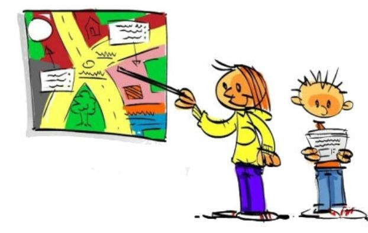

Een bedrijf kan niet lang voortbestaan en zijn kwaliteit handhaven zonder gedegen vastlegging en documentatie van de aanwezige kennis. 
Voor deze handleiding "Tekenen in ArcMap", waarin wordt beschreven hoe onder meer te werken met TOP10NL, is een aantal jaren geleden de grondslag gelegd bij de introduktie van Geo Verkenners binnen de sector Topografie. Daarna zijn er diverse updates uitgevoerd om onder meer de informatie actueel te houden. 
Met de opleiding Topografie voor landmeters wordt een volgende stap gezet om de toekomst van de sector Topografie binnen het Kadaster verder uit te bouwen, en een zekere plek te geven.

Ons land is voortdurend aan verandering onderhevig. Ons streven, nee, onze opdracht  is om die veranderingen zo snel en accuraat mogelijk te registeren: "in kaart te brengen", zeg maar, volgens strak gedefinieerde afspraken. Dat vereist niet alleen een gedegen kennis van de heersende regels, voorschriften en voorzieningen om dit vast te leggen, maar daarnaast ook een grote mate van creativiteit en ambitie. Ambitie om er een kwalitatief goed product neer te zetten: de lat ligt hoog (we hebben tenslotte een naam hoog te houden). 
Met het openen van de map die voor u ligt heeft u de start gemaakt van een bijzonder traject: u wordt ingewijd en opgeleid in het verrichten van Topografische werkzaamheden. U zult ervaren dat het vak van Topograaf een grote veelzijdigheid kent, en dat u vanaf nu dikwijls met een andere blik het landschap bekijkt. U zult ondervinden dat het vak wordt gekenmerkt door veelzijdigheid en diepgang. Tevens hopen wij op u de uitdagingen over te kunnen brengen die het topografenvak zelf in overvloed in zich heeft. 
De inhoud van de map, en de opbouw in modules, is het resultaat van de jarenlange kennis en ervaring die binnen de sector Topografie aanwezig is. Daarbij is gebruik gemaakt van zowel de ervaringen van de topografen zelf, alsmede die zijn opgedaan bij het opleiden van verschillende groepen: van Geo-Verkenners en Data-Verwerkers, tot Landmeters van het Kadaster en van externe partijen. Het zijn in beginsel Andy Benjamins (Gis-Topograaf en intern docent) en Robert Blok (Medewerker Operationeel Informatiemanage-ment) die er voor hebben gezorgd dat er nu een zeer leesbaar, praktisch en volledig document ligt, niet alleen bedoeld voor de nieuweling, maar ook voor de doorgewinterde vakkracht die een degelijk naslagwerk tot zijn beschikking heft gekregen. Daar zijn we trots op. Wij bouwen hiermee voort aan onze toekomst, en ik ben verheugd dat u daarin aktief wil participeren.

Ik wens u veel succes, en bovenal veel plezier toe met deze opleiding.

### Zie ook
[De map met actuele handleidingen over het proces](https://hetkadaster.sharepoint.com/sites/gd-odr/1e20b/Topografie/handleidingen/1-Processtappen%20TOP10NL/Actueel).

## Presentaties opleidingsmateriaal

|     |     |     |     |
| --- | --- | --- | --- |
| [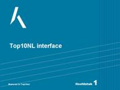](presentaties/01_Hoofdstuk_01_muteren_in_Top10nl.pps)  | [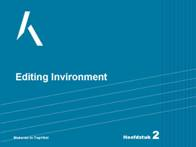](presentaties/02_Hoofdstuk_02_muteren_in_Top10nl.pps)  | [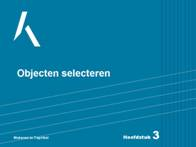](presentaties/03_Hoofdstuk_03_muteren_in_Top10nl.pps)     | [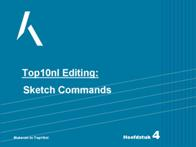](presentaties/04_Hoofdstuk_04_muteren_in_Top10nl.pps) |
| [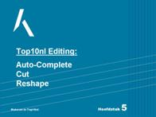](presentaties/05_Hoofdstuk_05_muteren_in_Top10nl.pps)  | [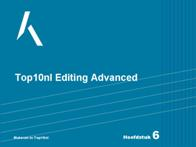](presentaties/06_Hoofdstuk_06_muteren_in_Top10nl.pps)  | [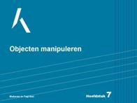](presentaties/07_Hoofdstuk_07_muteren_in_Top10nl.pps)     | [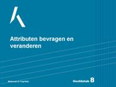](presentaties/08_Hoofdstuk_08_muteren_in_Top10nl.pps) |
| [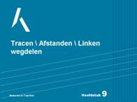](presentaties/09_Hoofdstuk_09_muteren_in_Top10nl.pps)  | [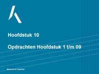](presentaties/10_Hoofdstuk_10_opdrachten_1_-_6.pps)   | [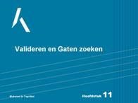](presentaties/11_Hoofdstuk_11_muteren_in_Top10nl.pps)    | [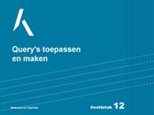](presentaties/12_Hoofdstuk_12_muteren_in_Top10nl.pps) |
| [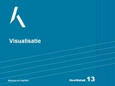](presentaties/13_Hoofdstuk_13_muteren_in_Top10nl.pps) | [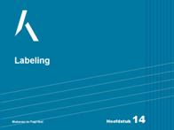](presentaties/14_Hoofdstuk_14_muteren_in_Top10nl.pps) | [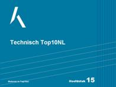](presentaties/15_Hoofdstuk_15_muteren_in_Top10nl.pps)    | [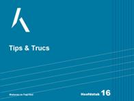](presentaties/16_Hoofdstuk_16_muteren_in_Top10nl.pps) |
|  | [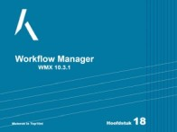](../../Esri_ArcGIS/Workflowmanager/video/WFM.mp4)       | [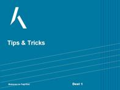](presentaties/19_Hoofdstuk_19_Tips_en_Tricks_deel_1.pps) | [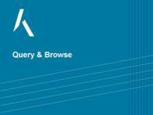](presentaties/Query_en_Browse_Handleiding_tbv_top10nlhelp.pps) |
