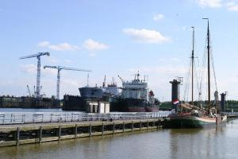
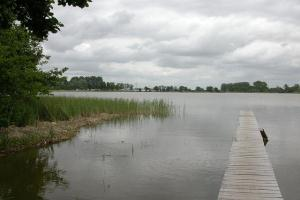
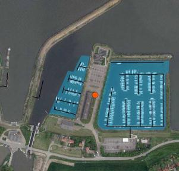
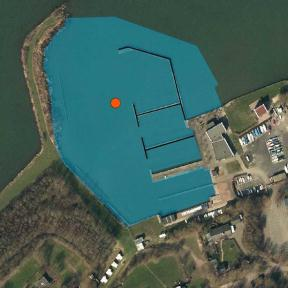
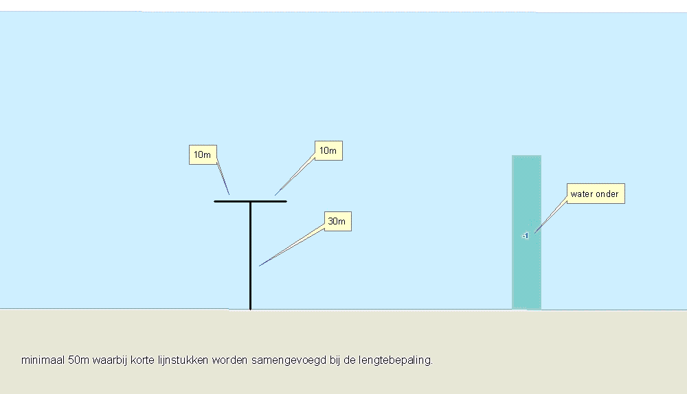

Aanlegsteiger
=============

## Definitie

In het water uitstekende brug of pier, gebruikt om personen en goederen aan wal te brengen.

## Regelgeving Topografie

### Smaller dan 2 meter
Wordt aangegeven als inrichtingselement van het type **aanlegsteiger**.
- Generaliserend weergeven met een minimum lengte voor opname van 50m.
- De minimumlengte geldt niet indien de aanlegsteiger is gelegen in een waterdeel met de functie **haven**. Generalisatie blijft echter wel van toepassing. Wel gegeven worden de hoofdstructuren maar niet de smallere loopplanken leidend naar één of enkele aangemeerde vaartuigen. Hetzelfde geldt voor daarop gelijkende loopplanken die rechtstreeks vanaf de wal toegang geven naar één of enkele vaartuigen.
- Een rij onderling verbonden meerpalen wordt aangegeven als aanlegsteiger.

### Breder dan 2 meter
Wordt aangegeven als terrein van het type landgebruik **aanlegsteiger**.
- Het onderliggende terrein of waterdeel krijgt **hoogteniveau** -1.
- Generaliserend weergeven met een minimumlengte voor opname van 50m.
- De minimumlengte geldt niet indien de aanlegsteiger is gelegen in een waterdeel met de functie haven (zie Voorbeeld in het terrein).

## Voorbeeld in het terrein

## Voorbeeld in ArcMap

----------------------
_zoekwoorden: steiger_