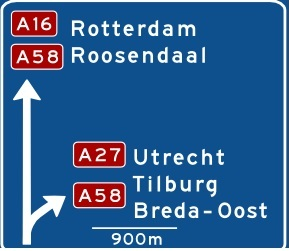

A-Wegnummer
===========

## Definitie

Nummering van de rijkswegen (autosnelwegen en autowegen) behorende tot het nationale wegenstelsel.

### Zie ook
[Wegnummering](../../W/Wegnummering/Wegnummering.html)

## Regelgeving Topografie

Wordt aangegeven als attribuutwaarde **A-wegnummer** aan de betreffende wegdelen, ook de wegdelen behorende tot de op- en afritten.
- In incidentele gevallen komt het voor dat een autosnelweg tijdelijk overgaat in een autoweg (AW8r) waarbij het A-wegnummer blijft doorlopen. In die gevallen is het toegestaan aan de autoweg het betreffende A-wegnummer toe te voegen.
- De uit- en toeritten bij een knooppunt krijgen het wegnummer van de weg waarvan ze af komen.

## Voorbeeld in het terrein

