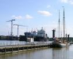

| [A](../A/A.html) | [B](../B/B.html) | [C](../C/C.html) | [D](../D/D.html) | [E](../E/E.html) | [F](../F/F.html) |
| [G](../G/G.html) | [H](../H/H.html) | [I](../I/I.html) | [J](../J/J.html) | [K](../K/K.html) | [L](../L/L.html) |
| [M](../M/M.html) | [N](../N/N.html) | [O](../O/O.html) | [P](../P/P.html) | [R](../R/R.html) | [S](../S/S.html) |
| [T](../T/T.html) | [U](../U/U.html) | [V](../V/V.html) | [W](../W/W.html) | [Z](../Z/Z.html) |

A
=

|   A-wegnummer |   Aanlegsteiger |  Aantal sporen|   Aardgas |   Aardrand |
|   Abdij |   Afrastering |   Afrit |   Afritnaam |   Afritnummer |
|   Afsluitbare duiker |   Afvalbrengstation |   Afvoerbuis |   Akkerland |   Alleenstaande toren |
|   Antenne |   Aquaduct |   Arboretum |   Artillerie schietkamp |   Atletiekbaan |
|   Attractiepark |   Attribuut |   Attribuutwaarde |   Autosnelweg |   Autoweg |
