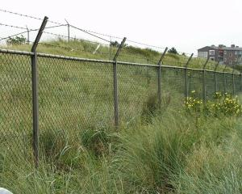
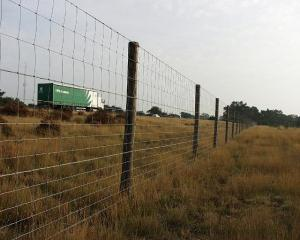
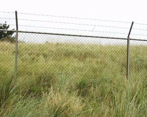
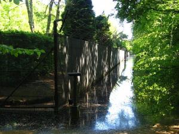
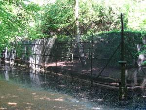
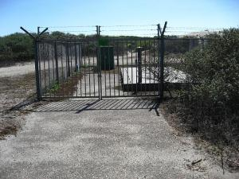
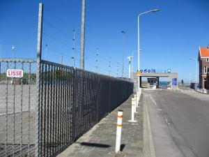

Afrastering
===========

## Definitie

Begrenzing van een terrein in de vorm van een hekwerk.

## Regelgeving Topografie

Wordt aangegeven als **inrichtingselement** van het type **hekwerk**.

Opnamecriteria:

* minimum hoogte: 2 meter.
* minimum lengte: 1000 meter.
* **Uitzondering**: Een omsluitend hekwerk rond een **gaswinning** of een **oliewinning** wordt aangegeven als inrichtingslijn van het type **hekwerk**, indien langer dan 400 meter.

Combinaties:

* Een afrastering langs de onderzijde of bovenzijde van een talud wordt met een aparte lijn aangegeven.
* Een afrastering langs een spoorweg, minder dan 6 meter uit de buitenste rail, wordt niet aangegeven
* Een afrastering, minder dan 6 meter uit een reeds aangegeven lijn, wordt met een aparte lijn aangegeven.
* Bij een combinatie van afrasteringen op een **industrieterrein / bedrijventerrein**, c.q. groot bedrijf, wordt de buitenste afrastering gegeven. In het aldus ontstane vlak selectief te werk gaan en alleen afrasteringen aangeven met een totale minimum lengte van 1000 m.

Indien een afrastering dwars over een weg loopt en ter plaatse een draaihek, slagboom o.i.d. aanwezig is, wordt alleen bij de hoofd in- en uitgang van het omsloten terrein een wegafsluiter geplaatst. Hierbij wel de regels voor een wegafsluiting toepassen (niet op een O>2). Indien de wegafsluiter niet gegeven wordt, wordt het hek doorgetrokken.

Zie ook [Gaswinning](../../G/Gaswinning/Gaswinning.html), [Oliewinning](../../O/Oliewinning/Oliewinning.html), [Wegafsluiting / Wegafsluiter](../../W/Wegafsluiting/Wegafsluiting.html)

## Voorbeeld in het terrein

