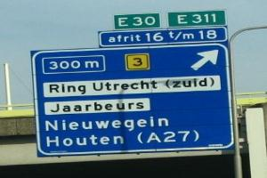
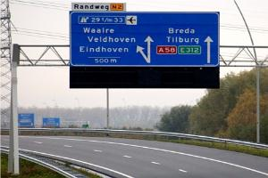

Afritnummer
===========

## Definitie

RWS afritnummering op autosnelweg en hoofdweg.

## Zie ook
[Op- en afrit](../../O/Oprit_Afrit/Oprit_Afrit.html) 
[Weg](../../W/Weg/Weg.html) 
[Wegenclassificaties](../../W/Wegenclassificaties/Wegenclassificaties.html)

## Regelgeving Topografie

Wordt aangegeven als attribuutwaarde **afritnummer** van het (de) betreffende wegdeel (wegdelen).

## Voorbeeld in het terrein

