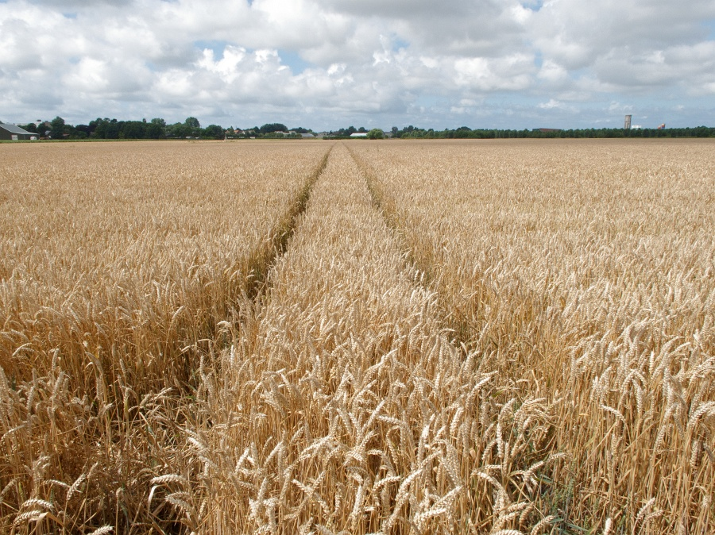
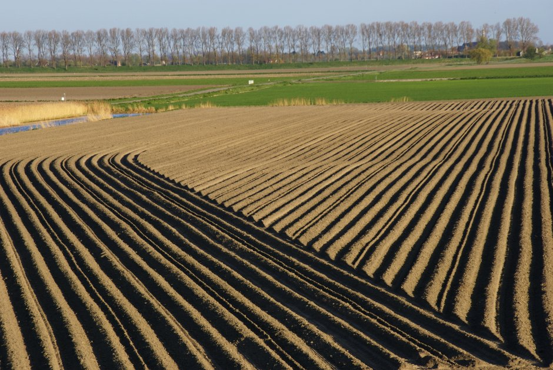
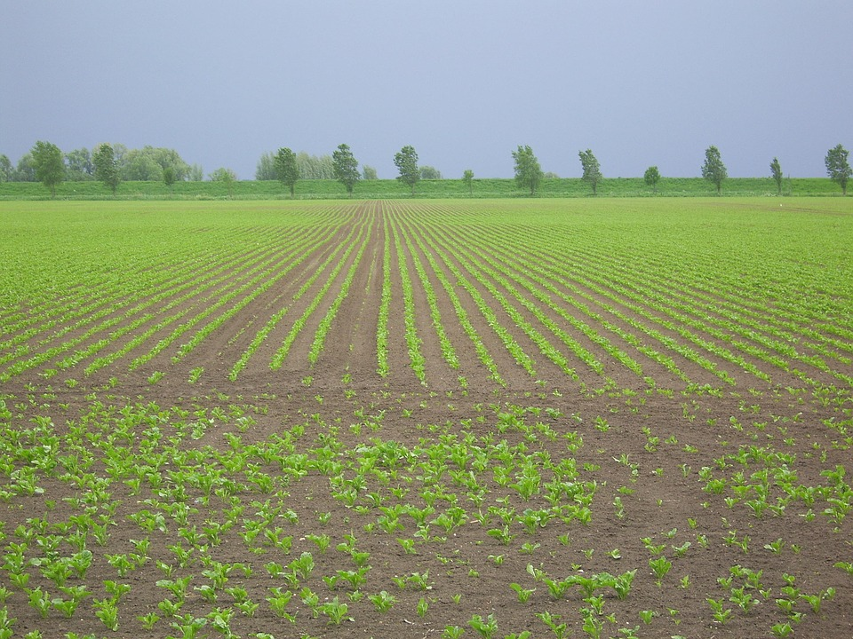
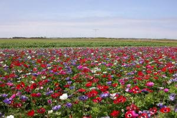
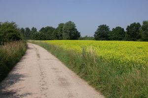
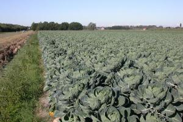
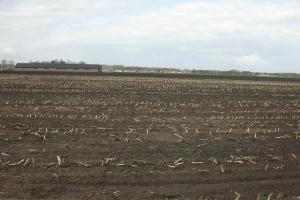
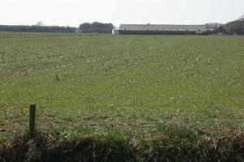
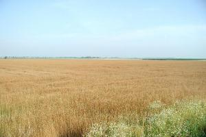
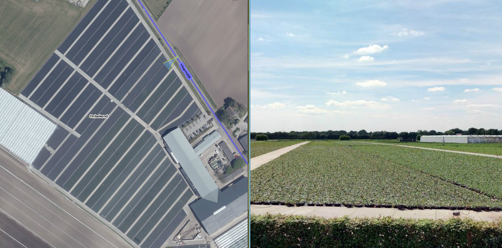

Akkerland
=========

## Definitie

**Terrein** waar landbouwproducten worden verbouwd.

Zie ook [Vloeiveld](../../V/Vloeiveld/Vloeiveld.html).

## Regelgeving Topografie

Wordt aangegeven als **terrein** van het type landgebruik **akkerland**.

Indien het akkerland tijdelijk onder water is gezet (bijv. t.b.v. de bollenteelt) worden de wallen en het water genegeerd.

### Toelichting

Vulling van dit attribuut vindt plaats vanuit de externe bron BRP. In dat geval is het betreffende gebied tijdens het scannen gemaskerd en mag hier niet aan gemuteerd worden.

## Voorbeeld in het terrein

In onderstaand voorbeeld geeft BRP akkerland aan (bijv. chrysanten, aardbeien- of aspergeplanten), maar het geheel oogt als een boomkwekerij. Hier BRP aanhouden.
Wegen wel gegeneraliseerd weergeven zoals op een kwekerij.

