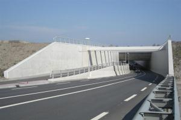

Aquaduct
========

## Definitie

Kunstwerk waarmee **water** over een **weg** of een ander **water** wordt gevoerd, zodanig geconstrueerd dat het dak van de onderdoorgang tevens de bodem van het bovengelegen **water** vormt.

### Zie ook
[Brug](../../B/Brug/Brug.html)

## Regelgeving Topografie

Wordt aangegeven door de attribuutwaarde fysiek voorkomen op brug toe te kennen aan het betreffende waterdeel. 
Een eigennaam of de soortnaam kunnen als attribuutwaarde brugnaam aan het betreffende waterdeel worden toegevoegd.

## Voorbeeld in het terrein

