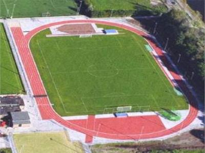
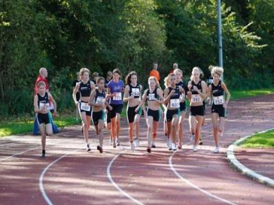

Atletiekbaan
============

## Definitie

Ovale baan voor atletiektrainingen en -wedstrijden.

## Regelgeving Topografie

Wordt aangegeven volgens fotobeeld, als een **terrein** van het type landgebruik **overig**. 
Het gehele object wordt ook aangegeven als **functioneel gebiedsvlak**.

## Voorbeeld in het terrein

