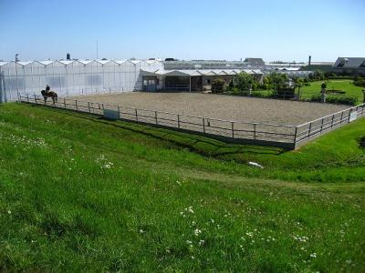
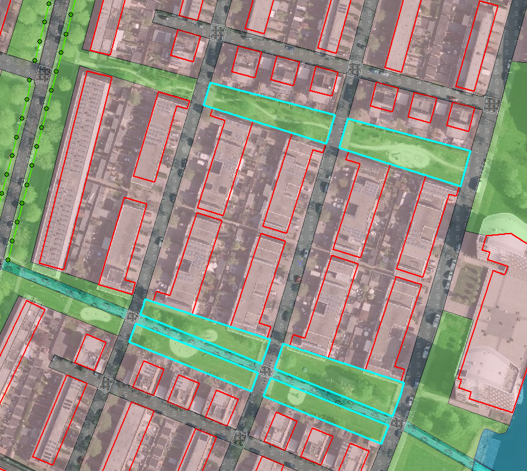

Object
======

## Definitie

Een fenomeen in de werkelijkheid.

## Soorten Objecten

### Puntobject

#### Definitie
Object dat, ondanks een zekere grootte, weergegeven wordt door een punt.

#### Regelgeving
Puntobjecten hebben een enkel x,y coördinaat.

### Lijnobject

#### Definitie
Object dat, ondanks een zekere breedte in het terrein, in het bestand weergegeven wordt d.m.v. een lijn, bijv. een **sloot**.

Zie voor maatvoeringen: [Overzicht maatvoering objecten](../Algemene_regels.html#overzicht-maatvoering-objecten).

#### Regelgeving
Lijnobjecten hebben minimaal een beginpunt en een eindpunt. Een lijnobject heeft een lengte.

### Vlakobject

#### Definitie
Vlakobjecten hebben minimaal 3 hoekpunten. Een vlakobject heeft een oppervlak.

### Zie ook
[Harde topografie](../../H/Harde_topografie/Harde_topografie.html)

Zie voor overige maatvoeringen: [Overzicht maatvoering objecten](../Algemene_regels.html#overzicht-maatvoering-objecten).

### Regelgeving
Minimummaten:
- Voor vlakken begrensd door tenminste één zachte topografische lijn of geheel omsloten door bos: 1000 m².

**_Uitzonderingen:_**
- Voor vlakken begrensd door uitsluitend **harde topografie** en **parkeerterreinen** met een oriënterende waarde gelegen in bosrijke gebieden geldt geen minimummaat.
- Te kleine vlakken die echter deel uitmaken van een logisch geheel mogen wel gegeven worden (zie ook onderstaand voorbeeld in ArcMap).
- Minimaal 50 m² voor bospartijen, gelegen buiten erven, buiten bebouwd gebied en niet zijnde een brede houtrand.
- Erven en parkeerterreinen doorsneden door een **weg**: afzonderlijke delen kleiner dan 1000 m² mogen gegeven worden, als totaal maar groter dan 1000 m² is.
- Bermen smaller dan 6 m worden, ongeacht hun oppervlakte, toegevoegd aan de weg of aan het naastgelegen vlakobject.
- Minimaal 50 m² voor **Water**.
- Minimaal 50 m² voor **Eiland**.
- Minimaal 50 m² voor **Dijkversteviging/ Basaltblokken, steenglooiing**.

### Toelichting
Kleine, naast elkaar gelegen vlakken (<1000 m²) worden samengevoegd tot één vlak als de samenvallende begrenzingen van deze vlakken gevormd worden door zachte topografische lijnen. Als code krijgt dit vlak de beste benadering voor het geheel.

## Voorbeeld in het terrein

## Voorbeeld in ArcMap

Te kleine vlakken (<1000) maar die echter deel uitmaken van een logisch groter geheel, mogen wel gegeven worden: 

Terrein 

