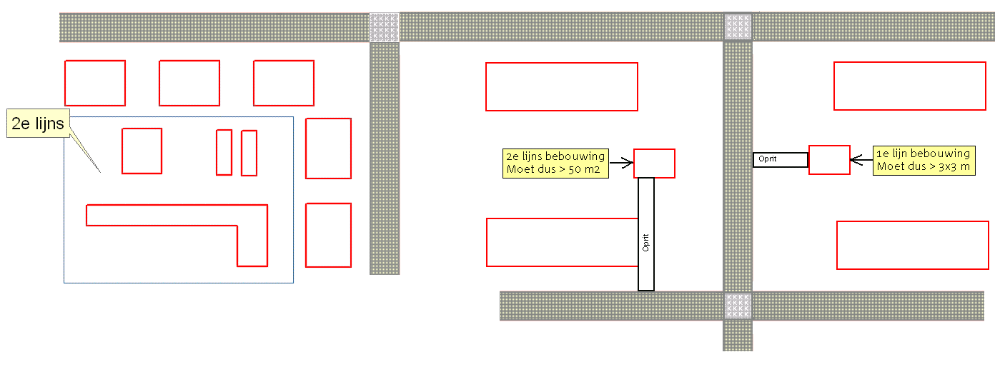
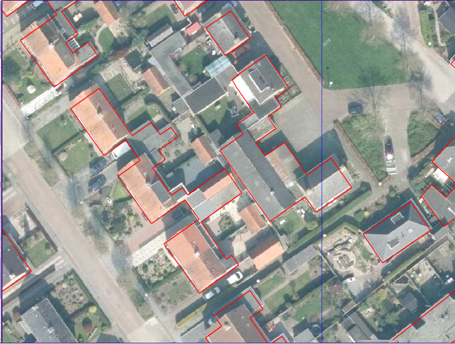
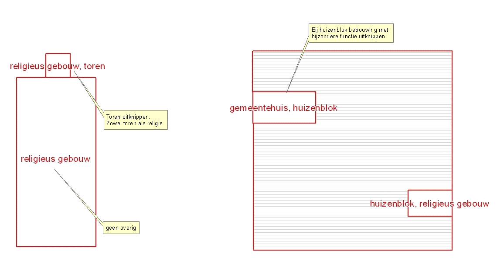

Voorbeelden Bebouwing - 2e lijns
================================

Aanvullende generalisatieregel t.a.v. het samentrekken van gebouwen: 
Ook worden twee gebouwen NIET samengevoegd als er sprake is van gebouwen in verschillende "rijen van bebouwing":

