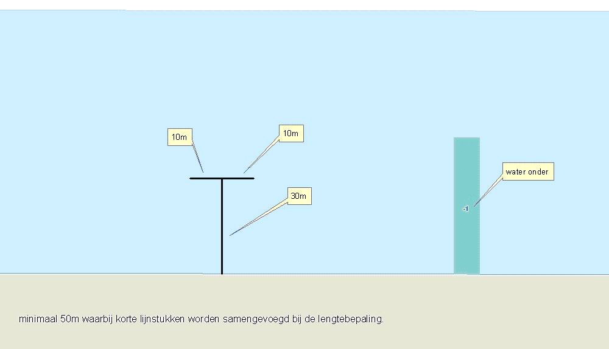

Voorbeelden in ArcMap
=====================

### Aanlegsteiger

Voor aanlegsteigers gelegen buiten een haven geldt een minimummaat van 50m waarbij de korte lijnstukken worden samengevoegd voor de lengtebepaling. Indien de aanlegsteiger is gelegen in een haven geldt er geen minimummaat. Generalisatieregels blijven echter wel van toepassing.

### 2e-lijns bebouwing

### Bebouwing - Type gebouw

### Bebouwing - Dok

### Begraafplaats

### Bomen langs straat / in plantsoen
Bomenrij langs straat mag indien de bomenrij gelegen is in een park of plantsoen.

### Bomenrij

### Bruggen

### Op oprit / afrit

### Overkluizing

### Spoorbaanlichaam

### Terrein

### Verkeersgeleider

### Weg met gescheiden rijbanen

### Weg naar parkeerplaats

### Weg over parkeerplaats

### Weg - O>2

### Weg - Voetpad

### Wegafsluiter

### Weg door voetgangersgebied

### Koedam

### Rotonde

### Bestaande bebouwing - NIET aanpassen:

### Bestaande bebouwing - WEL aanpassen:

### Geclassificeerde wegen

### Bijzondere situatie - Brug / Vonder
In onderstaande situatie is het validatie technisch niet mogelijk om dit juist in te tekenen, daarom is hiervoor de volgende oplossing gekozen:
- Daar waar de vonder over de HAP sloot gaat, zetten we de HAP sloot op hoogteniveau -1 (zonder fysiek voorkomen in duiker)
- Hartlijn van de halfverharde weg (4/5) stopt bij de HAP sloot -1
- Het "zwevende" hartlijntje op het kruisingsvlak krijgt als attribuut hoofdverkeersgebruik voetgangers of indien de vonder een rijwielpad is fietsers/bromfietsers

### Bijzondere situatie - Zwevende hartlijn
De vulling van de zwevende hartlijn in onderstaand plaatje wordt bepaald door de weglijn die in het verlengde ervan ligt (ongeacht voorkomen van het terrein ter plaatse van de zwevende hartlijn), in dit geval dus OW3.

Een uitzondering hierop kan gemaakt worden als het hoofdverkeersgebruik niet overeenkomt met het gebruik hiervan. Dan krijgt de zwevende hartlijn een andere waarde voor hoofdverkeersgebruik en kan het type weg ook mee veranderen.

### Weg - Rijstrook
Rijstrookvermelding bij Op-/Afritcombi en bij wegsplitsing.

Van belang is de wegmarkering (lijnen of blokken), die aangeeft of er sprake is van een rijstrook met speciale bestemming. Hieronder vallen ook in- en uitvoegstroken.

### Bebouwing - Chalet - Stacaravan

