| [A](../A/A.html) | [B](../B/B.html) | [C](../C/C.html) | [D](../D/D.html) | [E](../E/E.html) | [F](../F/F.html) |
| [G](../G/G.html) | [H](../H/H.html) | [I](../I/I.html) | [J](../J/J.html) | [K](../K/K.html) | [L](../L/L.html) |
| [M](../M/M.html) | [N](../N/N.html) | [O](../O/O.html) | [P](../P/P.html) | [R](../R/R.html) | [S](../S/S.html) |
| [T](../T/T.html) | [U](../U/U.html) | [V](../V/V.html) | [W](../W/W.html) | [Z](../Z/Z.html) |

B
=

<!--

|     |     |     |     |     |
| --- | --- | --- | --- | --- |

|  [Baak](Baak/Baak.html)
Baanvaknaam
|  [Balg](Balg/Balg.html)
|  [Bank](Bank/Bank.html)
|  [Basaltblokken, steenglooiing](Basaltblokken_steenglooiing/Basaltblokken_steenglooiing.html)
|  [Bebouwd gebied](Bebouwd_gebied/Bebouwd_gebied.html)
Bebouwd_oppervlak
| [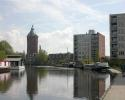](Bebouwing/Bebouwing.html) [Bebouwing](Bebouwing/Bebouwing.html)
Bebouwing_bijzondere_functie
| [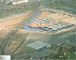](Bebouwing_boven_water/Bebouwing_boven_water.html) [Bebouwing boven water](Bebouwing_boven_water/Bebouwing_boven_water.html)
Bebouwing_hoogteklasse
| [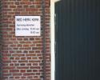](Bebouwing_met_religieuze_bestemming/Bebouwing_met_religieuze_bestemming.html) [Bebouwing met religieuze bestemming](Bebouwing_met_religieuze_bestemming/Bebouwing_met_religieuze_bestemming.html)
Bebouwing_ondergronds
|  [Bedrijventerrein](Bedrijventerrein/Bedrijventerrein.html)
|  [Beek](Beek/Beek.html)
| [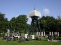](Begraafplaats/Begraafplaats.html) [Begraafplaats](Begraafplaats/Begraafplaats.html)
| [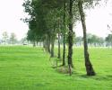](Begroeiing_en_bebouwing/Begroeiing_en_bebouwing.html) [Begroeiing en bebouwing](Begroeiing_en_bebouwing/Begroeiing_en_bebouwing.html)
|  [Bejaardencentrum](Bejaardencentrum/Bejaardencentrum.html)
| [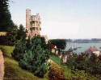](Belvedere/Belvedere.html) [Belvédère](Belvedere/Belvedere.html)
Berg
|  [Berm](Berm/Berm.html)
| [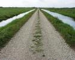](Bermsloot/Bermsloot.html) [Bermsloot](Bermsloot/Bermsloot.html)
Bestaande_bebouwing
| [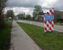](Bewoond_oord/Bewoond_oord.html) [Bewoond oord](Bewoond_oord/Bewoond_oord.html)
|  [Bezinkbak](Bezinkbak/Bezinkbak.html)
|  [Bezinktank](Bezinktank/Bezinktank.html)
|  [Bezoekerscentrum](Bezoekerscentrum/Bezoekerscentrum.html)
|  [Bidkapel](Bidkapel/Bidkapel.html)
| [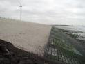](Bitumen/Bitumen.html) [Bitumen](Bitumen/Bitumen.html)
|  [Boerderij](Boerderij/Boerderij.html)
| [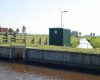](Boezem/Boezem.html) [Boezem](Boezem/Boezem.html)
| [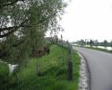](Boezemdijk/Boezemdijk.html) [Boezemdijk](Boezemdijk/Boezemdijk.html)
| [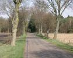](Bomenrij/Bomenrij.html) [Bomenrij](Bomenrij/Bomenrij.html)
| [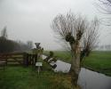](Boom/Boom.html) [Boom](Boom/Boom.html)
|  [Boomgaard](Boomgaard/Boomgaard.html)
|  [Boomgroep](Boomgroep/Boomgroep.html)
| [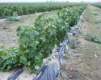](Boomkwekerij/Boomkwekerij.html) [Boomkwekerij](Boomkwekerij/Boomkwekerij.html)
Boorplatform
|  [Boortoren](Boortoren/Boortoren.html)
|  [Bos](Bos/Bos.html)
|  [Bos in water](Bos_in_water/Bos_in_water.html)
|  [Bosbad](Bosbad/Bosbad.html)
|  [Bosgebied](Bosgebied/Bosgebied.html)
| [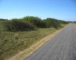](Bosopslag/Bosopslag.html) [Bosopslag](Bosopslag/Bosopslag.html)
|  [Boswachterij](Boswachterij/Boswachterij.html)
Botanische_tuin
Botenhelling
|  [Botenhuis](Botenhuis/Botenhuis.html)
| [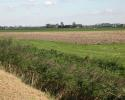](Bouwland/Bouwland.html) [Bouwland](Bouwland/Bouwland.html)
| [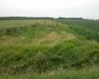](Braakliggend_terrein/Braakliggend_terrein.html) [Braakliggend terrein](Braakliggend_terrein/Braakliggend_terrein.html)
|  [Brandgang](Brandgang/Brandgang.html)
|  [Brandput](Brandput/Brandput.html)
| [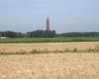](Brandtoren/Brandtoren.html) [Brandtoren](Brandtoren/Brandtoren.html)
Brandweekazerne
|  [Brede houtrand](Brede_houtrand/Brede_houtrand.html)
|  [Breedtebepaling](Breedtebepaling/Breedtebepaling.html)
|  [Brem](Brem/Brem.html)
|  [Bron, wel](Bron_Wel/Bron_Wel.html)
|  [Brug](Brug/Brug.html)
Brug_beweegbaar
Brug_in_combinatie_met
Brug_op_pijlers
Brug_vast
|  [Brugnaam](Brugnaam/Brugnaam.html)
| [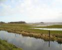](Buitendijkse_gronden/Buitendijkse_gronden.html) [Buitendijkse gronden](Buitendijkse_gronden/Buitendijkse_gronden.html)
|  [Buitenlands grondgebied](Buitenlands_grondgebied/Buitenlands_grondgebied.html)
| [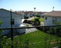](Bungalowpark/Bungalowpark.html) [Bungalowpark](Bungalowpark/Bungalowpark.html)
| [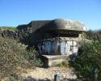](Bunker/Bunker.html) [Bunker](Bunker/Bunker.html)
|  [Busbaan](Busbaan/Busbaan.html)
|  [Bussluis](Bussluis/Bussluis.html)
Busstation
|  [Buurt](Buurt/Buurt.html)
|  [Buurtschap](Buurtschap/Buurtschap.html)

-->
