| [A](../A/A.html) | [B](../B/B.html) | [C](../C/C.html) | [D](../D/D.html) | [E](../E/E.html) | [F](../F/F.html) |
| [G](../G/G.html) | [H](../H/H.html) | [I](../I/I.html) | [J](../J/J.html) | [K](../K/K.html) | [L](../L/L.html) |
| [M](../M/M.html) | [N](../N/N.html) | [O](../O/O.html) | [P](../P/P.html) | [R](../R/R.html) | [S](../S/S.html) |
| [T](../T/T.html) | [U](../U/U.html) | [V](../V/V.html) | [W](../W/W.html) | [Z](../Z/Z.html) |

B

| [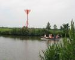](Baak/Baak.htm)  [Baak](Baak/Baak.htm) | [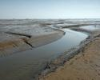](Balg/Balg.htm)  [Balg](Balg/Balg.htm) | [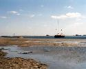](Bank/Bank.htm)  [Bank](Bank/Bank.htm) | [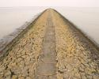](Basaltblokken%20_steenglooiing/Basaltblokken%20_steenglooiing.htm)  [Basaltblokken / steenglooiing](Basaltblokken%20_steenglooiing/Basaltblokken%20_steenglooiing.htm) | [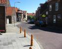](Bebouwd%20gebied/Bebouwd%20gebied.htm)  [Bebouwd gebied](Bebouwd%20gebied/Bebouwd%20gebied.htm) | [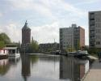](Bebouwing/Bebouwing.htm)  [Bebouwing](Bebouwing/Bebouwing.htm) |
| [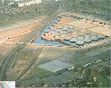](Bebouwing%20boven%20water/Bebouwing%20boven%20water.htm)  [Bebouwing boven water](Bebouwing%20boven%20water/Bebouwing%20boven%20water.htm) | [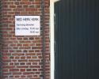](Bebouwing%20met%20religieuze%20bestemming/Bebouwing%20met%20religieuze%20bestemming.htm)  [Bebouwing met religieuze bestemming](Bebouwing%20met%20religieuze%20bestemming/Bebouwing%20met%20religieuze%20bestemming.htm) | [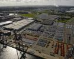](Bedrijventerrein/Bedrijventerrein.htm)  [Bedrijventerrein](Bedrijventerrein/Bedrijventerrein.htm) | [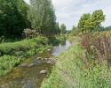](Beek/Beek.htm)  [Beek](Beek/Beek.htm) | [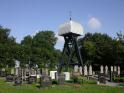](Begraafplaats/Begraafplaats.htm)  [Begraafplaats](Begraafplaats/Begraafplaats.htm) | [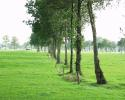](Begroeiing%20en%20bebouwing/Begroeiing%20en%20bebouwing.htm)  [Begroeiing en bebouwing](Begroeiing%20en%20bebouwing/Begroeiing%20en%20bebouwing.htm) |
| [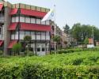](Bejaardencentrum/Bejaardencentrum.htm)  [Bejaardencentrum](Bejaardencentrum/Bejaardencentrum.htm) | [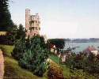](Belvédère/Belvédère.htm)  [Belvédère](Belvédère/Belvédère.htm) | [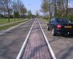](Berm/Berm.htm)  [Berm](Berm/Berm.htm) | [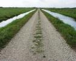](Bermsloot/Bermsloot.htm)  [Bermsloot](Bermsloot/Bermsloot.htm) | [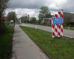](Bewoond%20oord/Bewoond%20oord.htm)  [Bewoond oord](Bewoond%20oord/Bewoond%20oord.htm) |   [Bezinkbak](Bezinkbak/Bezinkbak.htm) |
|   [Bezinktank](Bezinktank/Bezinktank.htm) | [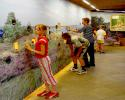](Bezoekerscentrum/Bezoekerscentrum.htm)  [Bezoekerscentrum](Bezoekerscentrum/Bezoekerscentrum.htm) | [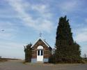](Bidkapel/Bidkapel.htm)  [Bidkapel](Bidkapel/Bidkapel.htm) | [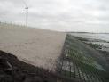](Bitumen/Bitumen.htm)  [Bitumen](Bitumen/Bitumen.htm) |   [Boerderij](Boerderij/Boerderij.htm) | [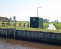](Boezem/Boezem.htm)  [Boezem](Boezem/Boezem.htm) |
| [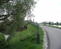](Boezemdijk/Boezemdijk.htm)  [Boezemdijk](Boezemdijk/Boezemdijk.htm) | [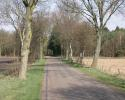](Bomenrij/Bomenrij.htm)  [Bomenrij](Bomenrij/Bomenrij.htm) |   [Boom](Boom/Boom.htm) | [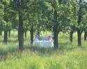](Boomgaard/Boomgaard.htm)  [Boomgaard](Boomgaard/Boomgaard.htm) | [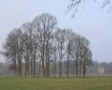](Boomgroep/Boomgroep.htm)  [Boomgroep](Boomgroep/Boomgroep.htm) | [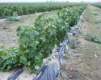](Boomkwekerij/Boomkwekerij.htm)  [Boomkwekerij](Boomkwekerij/Boomkwekerij.htm) |
| [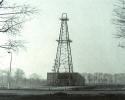](Boortoren/Boortoren.htm)  [Boortoren](Boortoren/Boortoren.htm) |   [Bos](Bos/Bos.htm) |   [Bos in water](Bos%20in%20water/Bos%20in%20water.htm) | [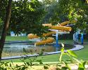](Bosbad/Bosbad.htm)  [Bosbad](Bosbad/Bosbad.htm) | [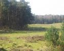](Bosgebied/Bosgebied.htm)  [Bosgebied](Bosgebied/Bosgebied.htm) | [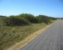](Bosopslag/Bosopslag.htm)  [Bosopslag](Bosopslag/Bosopslag.htm) |
|   [Boswachterij](Boswachterij/Boswachterij.htm) | [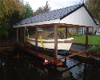](Botenhuis/Botenhuis.htm)  [Botenhuis](Botenhuis/Botenhuis.htm) | [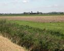](Bouwland/Bouwland.htm)  [Bouwland](Bouwland/Bouwland.htm) | [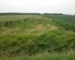](Braakliggend%20terrein/Braakliggend%20terrein.htm)  [Braakliggend terrein](Braakliggend%20terrein/Braakliggend%20terrein.htm) | [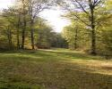](Brandgang/Brandgang.htm)  [Brandgang](Brandgang/Brandgang.htm) | [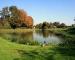](Brandput/Brandput.htm)  [Brandput](Brandput/Brandput.htm) |
| [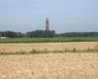](Brandtoren/Brandtoren.htm)  [Brandtoren](Brandtoren/Brandtoren.htm) |   [Brede houtrand](Brede%20houtrand/Brede%20houtrand.htm) |   [Breedtebepaling](Breedtebepaling/Breedtebepaling.htm) | [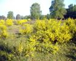](Brem/Brem.htm)  [Brem](Brem/Brem.htm) |   [Bron, wel](Bron,%20Wel/Bron,%20Wel.htm) | [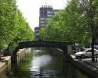](Brug/Brug.htm)  [Brug](Brug/Brug.htm) |
| [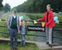](Brugnaam/Brugnaam.htm)  [Brugnaam](Brugnaam/Brugnaam.htm) | [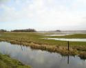](Buitendijkse%20gronden/Buitendijkse%20gronden.htm)  [Buitendijkse gronden](Buitendijkse%20gronden/Buitendijkse%20gronden.htm) |   [Buitenlands grondgebied](Buitenlands%20grondgebied/Buitenlands%20grondgebied.htm) | [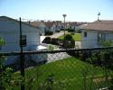](Bungalowpark/Bungalowpark.htm)  [Bungalowpark](Bungalowpark/Bungalowpark.htm) | [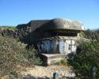](Bunker/Bunker.htm)  [Bunker](Bunker/Bunker.htm) | [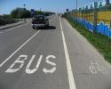](Busbaan/Busbaan.htm)  [Busbaan](Busbaan/Busbaan.htm) |
| [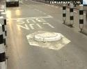](Bussluis/Bussluis.htm)  [Bussluis](Bussluis/Bussluis.htm) | [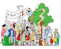](Buurt/Buurt.htm)  [Buurt](Buurt/Buurt.htm) | [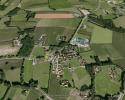](Buurtschap/Buurtschap.htm)  [Buurtschap](Buurtschap/Buurtschap.htm) |     |     |     |
