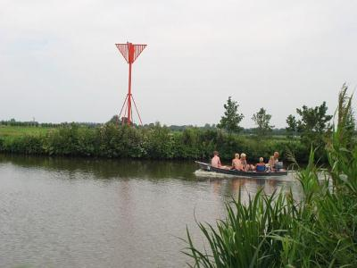
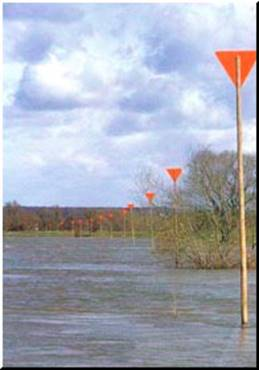
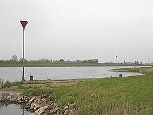
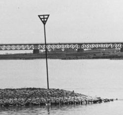

Baak
====

## Definitie

Markering van de loop van een vaarwater t.b.v. de binnenscheepvaart.

### Zie ook
[Kaap (baken)](../../K/Kaap_Baken/Kaap_Baken.html)

## Regelgeving Topografie

De topografie wordt aangegeven volgens fotobeeld.

## Regelgeving Thematisch Proces

Dit wordt bijgehouden in een apart thematisch proces, zie [Externe bronnen / data](../../E/Externe_data/Externe_bronnen_data.html).

Een baak voor de binnenvaart geven we aan als **inrichtingspunt** van het type **baak**. Een baak voor de zeevaart geven we aan als **inrichtingspunt** van het type **kaap**.

We geven alleen baken die het begin van een waterloop of een kruising van waterlopen markeren. We geven geen baken langs de loop van een rivier of kanaal.

### Naam
Een eigennaam kan als attribuutwaarde naam aan de baak worden toegevoegd. 
Zie ook [Namen](../../N/Namen/Namen.html)

## Voorbeeld in het terrein

Voorbeeld van een baak:

Onderstaande baken worden **niet** ingewonnen:

