Bebouwing
=========

## Definitie

Alles wat gebouwd is,

* met een permanent karakter,
* ongeacht de gebruikte materialen en
* bedoeld voor verblijf, voor handel, verkeer en/of arbeid.

De volgende bebouwingstypen worden onderscheiden:

* **gebouw**
* **bebouwd oppervlak**

Binnen elk van deze typen zijn weer andere types te onderscheiden:

* **hoogbouw**
* **bijzondere functie**.

Zie ook [Bestaande bebouwing](../Bestaande_bebouwing/Bestaande_bebouwing.html). 
Zie ook [Overkluizing](../../O/Overkluizing/Overkluizing.html).

Zie ook [Drijvende bebouwing](../../D/Drijvende_bebouwing/Drijvende_bebouwing.html).

Zie ook [Stapmolen (Tredmolen)](../../S/Stapmolen/Stapmolen.html).

Zie ook Voorbeelden: [2e Lijns bebouwing](../../../Voorbeelden/2e_lijns_bebouwing.html).

Zie ook [Voorbeeld in ArcMap](#Voorbeel) van Overkluizing.

Zie ook [Daktuin](../../D/Daktuin/Daktuin.html).

Zie ook [Zonnepark](../../Z/Zonnepark/Zonnepark.html).

## Regelgeving Topografie

In de reguliere herzieningsflow worden mutaties aan de geometrieën (met uitzondering van gebouwpunten) van bebouwing geüpdatet via een extern proces gebaseerd op de BAG. Zie [handleiding BAG](../../../Handleidingen/Handleiding_update_bebouwing_met_BAG_mutaties_v_0.2.pdf).

### Bij het aangeven van bebouwing wordt uitgegaan van de volgende uitgangspunten:

1.  De fysieke aanwezigheid van bebouwing is van belang, niet de functie van de bebouwing.
2.  De begrenzing van bebouwing wordt zoveel mogelijk d.m.v. 3D voorverkenning uitgelezen.
3.  Bebouwing wordt aangegeven zoals deze zich in het terrein voordoet: aaneengeschakelde bebouwing wordt als een gesloten front weergegeven.

### Algemene regels t.a.v. bebouwing:

* De orthogonale projectie van de uiterste buitenrand van de bebouwing, inclusief carports maar exclusief **luifels**, op het onderliggende terrein (incl. water) wordt aangegeven.
* Bebouwing, gelegen onder de projectie van andere bebouwing, wordt niet aangegeven.
* Bebouwing geheel gelegen onder een ander object wordt niet gegeven. Is echter een deel van het gebouw wel zichtbaar dan wordt het gehele gebouw op basis van interpretatie zo goed mogelijk aangegeven waarbij het gebouwdeel gelegen onder het object een hoogteniveau kleiner dan nul krijgt. Is het bovengelegen object echter een ander gebouw dan wordt het betreffende gebouwdeel overkluisd gegeven met als hoogteniveau nul.
* Bebouwing boven (hoge) poorten maakt onderdeel uit van de opgaande bebouwing.
* Bebouwing, geheel of gedeeltelijk gelegen over een ander object, wordt als bebouwing aangegeven. Voor het betreffende **object** onder het gebouw: zie **overkluizing** c.q. **passage**.
* Indien een gebouw volledig is omsloten door een wegdeel dient er ter grootte van het gebouw een terreinvlak onder aangebracht te worden.
* Als bebouwing nergens meer voor gebruikt wordt, dan status = “buiten gebruik” geven. Terughoudend gebruik van het attribuut naam om voormalige functies vast te leggen.
* Bij het generaliseren van bebouwing geldt (in volgorde van prioriteit):
    * Twee stukken bebouwing worden samengevoegd indien de afstand tussen de orthogonale projecties 2 m. of minder bedraagt, behalve als er tussen de gebouwen een **weg** of **sloot** voorkomt.
        
    * Uitbouwsels tot plm. 3*3 m en luifels verwaarloosd worden.
        
    * Inspringingen tot plm. 3*3 m worden aangegeven als onderdeel van de bebouwing.
        

Zie verder bij de verschillende bebouwingstypen.

* Een gebouw of gebouwencomplex wordt beschreven.
* Een eigennaam kan als attribuutwaarde **naam** aan het object worden toegevoegd. Een bedrijfsnaam wordt echter niet gegeven.

### Toelichting

Zie voor bestaande bebouwing: [Algemene regels](../../../Algemene_regels.htm#Herzieni) (interpretatieverschillen tussen vorige en huidige herziening, alinea bestaande bebouwing) of [Bestaande bebouwing](../Bestaande_bebouwing/Bestaande_bebouwing.html).

### Type bebouwingen

|     |     |     |
| --- | --- | --- |  
| [Bebouwd oppervlak](../Bebouwd_oppervlak/Bebouwd_oppervlak.html)   | [Bijzondere functie](../Bebouwing_bijzondere_functie/Bebouwing_bijzondere_functie.html) | [Carport](../../C/Carport/Carport.html) |
| [Chalet](../../C/Chalet/Chalet.html)                                   | [Containerwoning](../../C/Containerwoning/Containerwoning.html) | [Gebouw](../../G/Gebouw/Gebouw.html) |
| [Gebouwpunt](../../G/Gebouwpunt/Gebouwpunt.html)                       | [Hoogbouw](../../H/Hoogbouw/Hoogbouw.html) | [Hoogteklasse](../Bebouwing_Hoogteklasse/Bebouwing_Hoogteklasse.html) |
| [Kas, Warenhuis](../../K/Kas,_Warenhuis/Kas,_Warenhuis.html)       | [Kas, Warenhuis verrijdbaar](../../K/Kas,_Warenhuis_verrijdbaar/Kas,_Warenhuis_verrijdbaar.html) | [Lintbebouwing](../../L/Lintbebouwing/Lintbebouwing.html) |
| [Markant gebouw](../../M/Markant_gebouw/Markant_gebouw.html)       | [Ondergronds](../Bebouwing_ondergronds/Bebouwing_ondergronds.html) | [Romneyloods](../../R/Romneyloods/Romneyloods.html) |
| [Stacaravan](../../S/Stacaravan/Stacaravan.html)                       | [Strandpaviljoen](../../S/Strandpaviljoen/Strandpaviljoen.html) | [Tank](../../T/Tank/Tank.html) |
| [Woonwagen](../../W/Woonwagen/Woonwagen.html)                          |     |     |

## Voorbeeld in het terrein

Geven als bebouwing:  

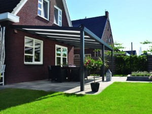
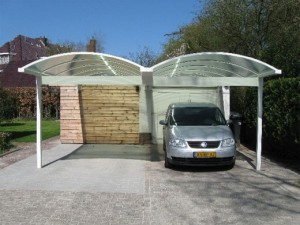

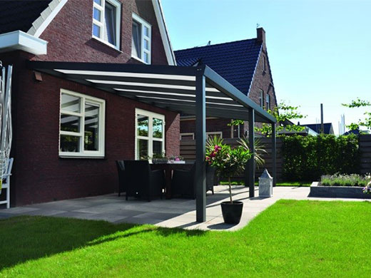

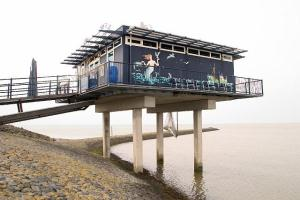
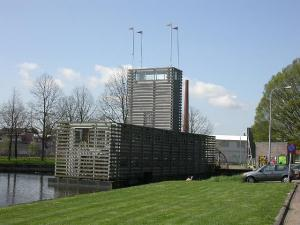
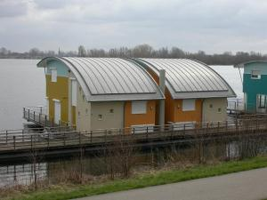
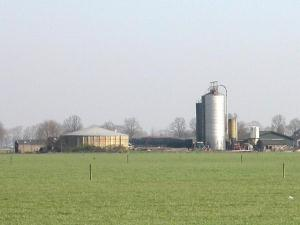
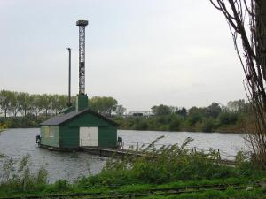
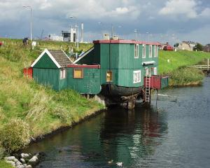
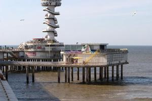
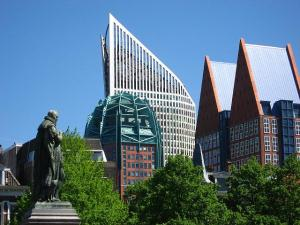
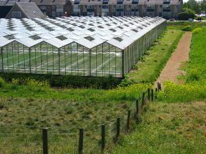
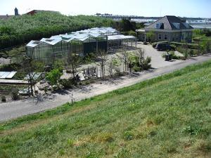
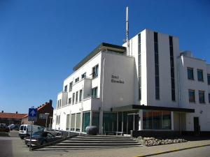
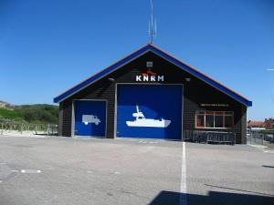
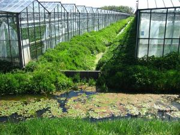
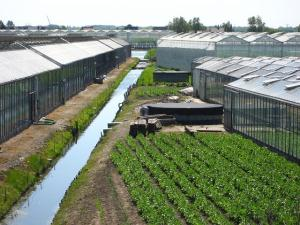
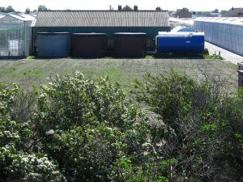
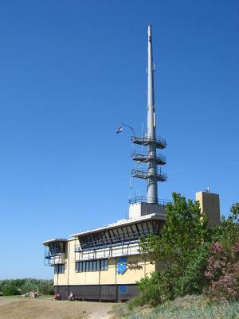
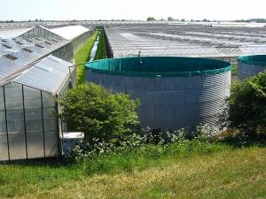

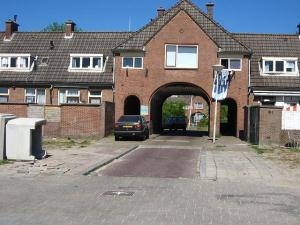
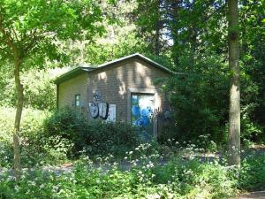
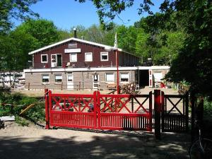
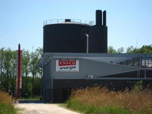
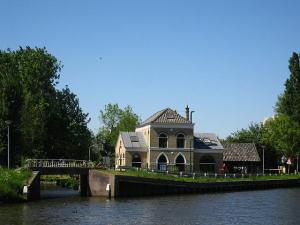
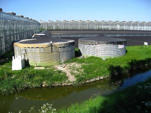
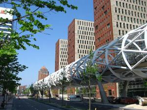
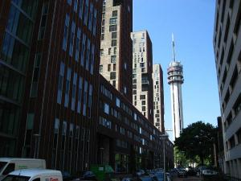

## Voorbeeld in ArcMap

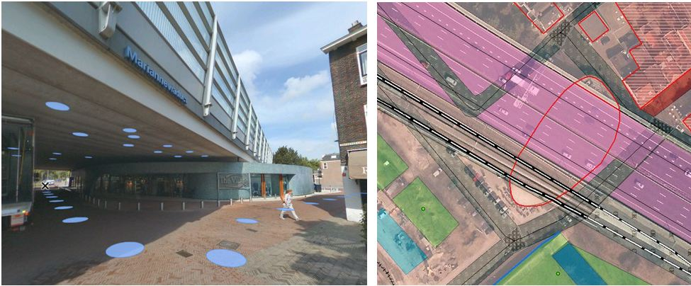