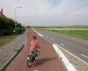
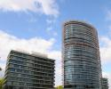
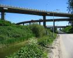
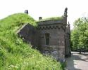
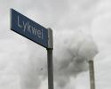
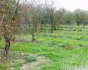

| [A](../A/A.html) | [B](../B/B.html) | [C](../C/C.html) | [D](../D/D.html) | [E](../E/E.html) | [F](../F/F.html) |
| [G](../G/G.html) | [H](../H/H.html) | [I](../I/I.html) | [J](../J/J.html) | [K](../K/K.html) | [L](../L/L.html) |
| [M](../M/M.html) | [N](../N/N.html) | [O](../O/O.html) | [P](../P/P.html) | [R](../R/R.html) | [S](../S/S.html) |
| [T](../T/T.html) | [U](../U/U.html) | [V](../V/V.html) | [W](../W/W.html) | [Z](../Z/Z.html) |

F
=

|     |     |     |     |     |
| --- | --- | --- | --- | --- |
|  [Fabriek](Fabriek/Fabriek.html) |  [Fietspad](Fietspad/Fietspad.html)                                         |  [Fietsstraat](Fietsstraat/Fietsstraat.html)                |  [Flat](Flat/Flat.html)                                                       |  [Fly-over](Fly-over/Fly-over.html) |
|  [Fort](Fort/Fort.html)             |  [Friese toponiemen](Friese_toponiemen/Friese_toponiemen.html) |  [Fruitkwekerij](Fruitkwekerij/Fruitkwekerij.html) |  [Functioneel gebied](Functioneel_gebied/Functioneel_gebied.html) |                                                                         |
