| [A](../A/A.html) | [B](../B/B.html) | [C](../C/C.html) | [D](../D/D.html) | [E](../E/E.html) | [F](../F/F.html) |
| [G](../G/G.html) | [H](../H/H.html) | [I](../I/I.html) | [J](../J/J.html) | [K](../K/K.html) | [L](../L/L.html) |
| [M](../M/M.html) | [N](../N/N.html) | [O](../O/O.html) | [P](../P/P.html) | [R](../R/R.html) | [S](../S/S.html) |
| [T](../T/T.html) | [U](../U/U.html) | [V](../V/V.html) | [W](../W/W.html) | [Z](../Z/Z.html) |

H
=

|     |     |     |     |     |
| --- | --- | --- | --- | --- |

| [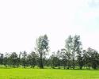](Haag/Haag.html) [Haag](Haag/Haag.html)
| [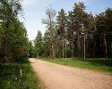](Halfverharde_weg/Halfverharde_weg.html) [Halfverharde weg](Halfverharde_weg/Halfverharde_weg.html)
|  [Harde Topografie](Harde_Topografie/Harde_Topografie.html)
|  [Hartlijn](Hartlijn/Hartlijn.html)
|  [Hartpunt](Hartpunt/Hartpunt.html)
| [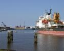](Haven/Haven.html) [Haven](Haven/Haven.html)
Haven_Woonboten
| [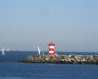](Havenhoofd/Havenhoofd.html) [Havenhoofd](Havenhoofd/Havenhoofd.html)
| [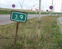](Hectometerpaal/Hectometerpaal.html) [Hectometerpaal](Hectometerpaal/Hectometerpaal.html)
| [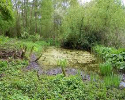](Heemtuin/Heemtuin.html) [Heemtuin](Heemtuin/Heemtuin.html)
| [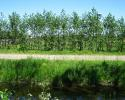](Heg_Haag/Heg_Haag.html) [Heg / Haag](Heg_Haag/Heg_Haag.html)
| [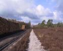](Heide/Heide.html) [Heide](Heide/Heide.html)
| [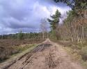](Heidegebied/Heidegebied.html) [Heidegebied](Heidegebied/Heidegebied.html)
|  [Hek](Hek/Hek.html)
|  [Hekwerk](Hekwerk/Hekwerk.html)
| [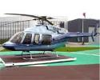](Helikopterlandingsplatform/Helikopterlandingsplatform.html) [Helikopterlandingsplatform](Helikopterlandingsplatform/Helikopterlandingsplatform.html)
|  [Helikopterlandingsterrein](Helikopterlandingsterrein/Helikopterlandingsterrein.html)
| [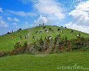](Heuvel/Heuvel.html) [Heuvel](Heuvel/Heuvel.html)
| [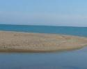](Hoek/Hoek.html) [Hoek](Hoek/Hoek.html)
| [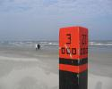](Hoekpuntpaal/Hoekpuntpaal.html) [Hoekpuntpaal](Hoekpuntpaal/Hoekpuntpaal.html)
| [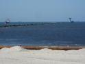](Hoofd/Hoofd.html) [Hoofd](Hoofd/Hoofd.html)
|  [Hoofdafwateringspatroon (HAP)](Hoofdafwateringspatroon/Hoofdafwateringspatroon.html)
Hoofdspoor
Hoofdverkeersgebruik
| [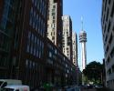](Hoogbouw/Hoogbouw.html) [Hoogbouw](Hoogbouw/Hoogbouw.html)
| [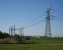](Hoogspanningsleiding/Hoogspanningsleiding.html) [Hoogspanningsleiding](Hoogspanningsleiding/Hoogspanningsleiding.html)
| [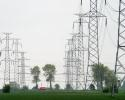](Hoogspanningsmast/Hoogspanningsmast.html) [Hoogspanningsmast](Hoogspanningsmast/Hoogspanningsmast.html)
Hoogte
| [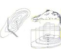](Hoogtelijn/Hoogtelijn.html) [Hoogtelijn](Hoogtelijn/Hoogtelijn.html)
| [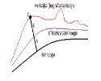](Hoogtepunt/Hoogtepunt.html) [Hoogtepunt](Hoogtepunt/Hoogtepunt.html)
| [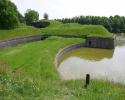](Hoogteverschil/Hoogteverschil.html) [Hoogteverschil](Hoogteverschil/Hoogteverschil.html)
|  [Hoogwaterlijn](Hoogwaterlijn/Hoogwaterlijn.html)
| [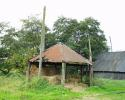](Hooiberg/Hooiberg.html) [Hooiberg](Hooiberg/Hooiberg.html)
|  [Hotel](Hotel/Hotel.html)
|  [Houtrand](Houtrand/Houtrand.html)
| [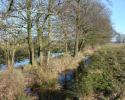](Houtwal/Houtwal.html) [Houtwal](Houtwal/Houtwal.html)
| [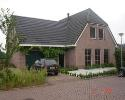](Huis_huizenrij/Huis_huizenrij.html) [Huis / Huizenrij](Huis_huizenrij/Huis_huizenrij.html)
| [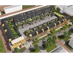](Huizenblok/Huizenblok.html) [Huizenblok](Huizenblok/Huizenblok.html)
| [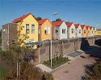](Huizengroep/Huizengroep.html) [Huizengroep](Huizengroep/Huizengroep.html)|
|  [Hulpsecretarie](Hulpsecretarie/Hulpsecretarie.html)
|  [Hunebed](Hunebed/Hunebed.html)
|  [Hydrografische kaarten](Hydrografische_kaarten/Hydrografische_kaarten.html)
