| [A](../A/A.html) | [B](../B/B.html) | [C](../C/C.html) | [D](../D/D.html) | [E](../E/E.html) | [F](../F/F.html) |
| [G](../G/G.html) | [H](../H/H.html) | [I](../I/I.html) | [J](../J/J.html) | [K](../K/K.html) | [L](../L/L.html) |
| [M](../M/M.html) | [N](../N/N.html) | [O](../O/O.html) | [P](../P/P.html) | [R](../R/R.html) | [S](../S/S.html) |
| [T](../T/T.html) | [U](../U/U.html) | [V](../V/V.html) | [W](../W/W.html) | [Z](../Z/Z.html) |

K
=

<!--

|     |     |     |     |     |
| --- | --- | --- | --- | --- |

| [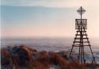](Kaap/Kaap.html) [Kaap (baken)](Kaap/Kaap.html)
| [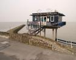](Kaap_als_landtong/Kaap_als_landtong.html) [Kaap (Landtong)](Kaap_als_landtong/Kaap_als_landtong.html)
| [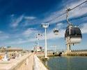](Kabelbaan/Kabelbaan.html) [Kabelbaan](Kabelbaan/Kabelbaan.html)
| [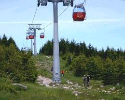](Kabelbaanmast/Kabelbaanmast.html) [Kabelbaanmast](Kabelbaanmast/Kabelbaanmast.html)
| [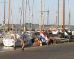](Kade/Kade.html) [Kade](Kade/Kade.html)
| [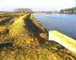](Kade_wal/Kade_wal.html) [Kade / wal](Kade_wal/Kade_wal.html)
|  [Kalkoven](Kalkoven/Kalkoven.html)
| [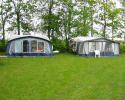](Kampeerterrein/Kampeerterrein.html) [Kampeerterrein](Kampeerterrein/Kampeerterrein.html)
| [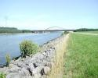](Kanaal/Kanaal.html) [Kanaal](Kanaal/Kanaal.html)
| [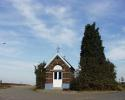](Kapel/Kapel.html) [Kapel, bidkapel](Kapel/Kapel.html)
|  [Kapschuur](Kapschuur/Kapschuur.html)
| [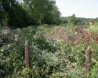](Kapvlakte/Kapvlakte.html) [Kapvlakte](Kapvlakte/Kapvlakte.html)
|  [Kardoes](Kardoes/Kardoes.html)
| [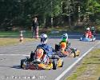](Kartingbaan/Kartingbaan.html) [Kartingbaan](Kartingbaan/Kartingbaan.html)
| [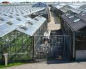](Kas_Warenhuis/Kas_Warenhuis.html) [Kas, Warenhuis](Kas_Warenhuis/Kas_Warenhuis.html)
Kas_warenhuis_verrijdbaar
Kassengebied
| [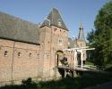](Kasteel/Kasteel.html) [Kasteel](Kasteel/Kasteel.html)
| [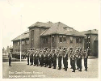](Kazerne/Kazerne.html) [Kazerne, Legerplaats](Kazerne/Kazerne.html)
| [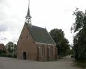](Kerk/Kerk.html) [Kerk](Kerk/Kerk.html)
| [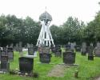](Kerkhof/Kerkhof.html) [Kerkhof](Kerkhof/Kerkhof.html)
| [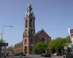](Kerktoren/Kerktoren.html) [Kerktoren](Kerktoren/Kerktoren.html)
|  [Kerncentrale](Kerncentrale/Kerncentrale.html)
| [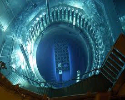](Kernreactor/Kernreactor.html) [Kernreactor](Kernreactor/Kernreactor.html)
| [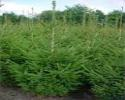](Kerstsparkwekerij/Kerstsparkwekerij.html) [Kerstsparkwekerij](Kerstsparkwekerij/Kerstsparkwekerij.html)
|  [Kijkhut](Kijkhut/Kijkhut.html)
|  [Kilometerpaal](Kilometerpaal/Kilometerpaal.html)
|  [Kilometerraai](Kilometerraai/Kilometerraai.html)
| [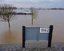](Kilometerraaibord/Kilometerraaibord.html) [Kilometerraaibord](Kilometerraaibord/Kilometerraaibord.html)
| [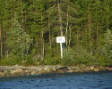](Kilometerraaipaal/Kilometerraaipaal.html) [Kilometerraaipaal](Kilometerraaipaal/Kilometerraaipaal.html)
| [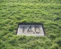](Kilometrering/Kilometrering.html) [Kilometrering](Kilometrering/Kilometrering.html)
Kilometrering_dijk
Kilometrering_metro
Kilometrering_Rivier
Kilometrering_Spoorweg
Kilometrering_Waterweg
Kilometrering_Weg
|  [KI-station](KI-station/KI-station.html)
Klimtoren
| [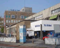](Kliniek/Kliniek.html) [Kliniek](Kliniek/Kliniek.html)
| [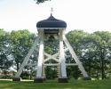](Klokkenstoel/Klokkenstoel.html) [Klokkenstoel](Klokkenstoel/Klokkenstoel.html)
| [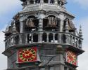](Klokkentoren/Klokkentoren.html) [Klokkentoren](Klokkentoren/Klokkentoren.html)
| [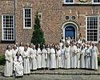](Klooster/Klooster.html) [Klooster](Klooster/Klooster.html)
| [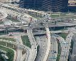](Knooppunt/Knooppunt.html) [Knooppunt](Knooppunt/Knooppunt.html)
|  [Knooppuntnaam](Knooppuntnaam/Knooppuntnaam.html)
|  [Koedam](Koedam/Koedam.html)
| [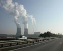](Koeltoren/Koeltoren.html) [Koeltoren](Koeltoren/Koeltoren.html)
|  [Koepad](Koepad/Koepad.html)
| [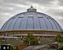](Koepel/Koepel.html) [Koepel](Koepel/Koepel.html)
|  [Koetunnel](Koetunnel/Koetunnel.html)
| [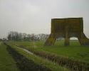](Kogelvanger/Kogelvanger.html) [Kogelvanger](Kogelvanger/Kogelvanger.html)
|  [Kolk](Kolk/Kolk.html)
|  [Korenmolen](Korenmolen/Korenmolen.html)
|  [Kraan](Kraan/Kraan.html)
| [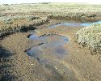](Kreek/Kreek.html) [Kreek](Kreek/Kreek.html)
| [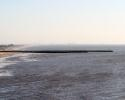](Krib/Krib.html) [Krib](Krib/Krib.html)
| [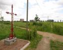](Kruis/Kruis.html) [Kruis](Kruis/Kruis.html)
|  [Kruispunt / Kruisingsvlak](Kruispunt/Kruispunt.html)
| [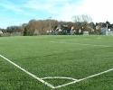](Kunstgras/Kunstgras.html) [Kunstgras](Kunstgras/Kunstgras.html)
| [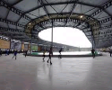](Kunstijsbaan/Kunstijsbaan.html) [Kunstijsbaan](Kunstijsbaan/Kunstijsbaan.html)
|  [Kwekerij](Kwekerij/Kwekerij.html)
|  [Kwelder](Kwelder/Kwelder.html)

-->
