| [A](../A/A.html) | [B](../B/B.html) | [C](../C/C.html) | [D](../D/D.html) | [E](../E/E.html) | [F](../F/F.html) |
| [G](../G/G.html) | [H](../H/H.html) | [I](../I/I.html) | [J](../J/J.html) | [K](../K/K.html) | [L](../L/L.html) |
| [M](../M/M.html) | [N](../N/N.html) | [O](../O/O.html) | [P](../P/P.html) | [R](../R/R.html) | [S](../S/S.html) |
| [T](../T/T.html) | [U](../U/U.html) | [V](../V/V.html) | [W](../W/W.html) | [Z](../Z/Z.html) |

M
=

|     |     |     |     |     |
| --- | --- | --- | --- | --- |

| [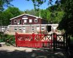](Manege/Manege.html) [Manege](Manege/Manege.html) 
Markant_gebouw
|  [Markant object](Markant_object/Markant_object.html) 
|  [Mast](Mast/Mast.html) 
|  [Meer](Meer/Meer.html) 
Meer_plas
| [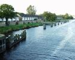](Meerpaal/Meerpaal.html) [Meerpaal](Meerpaal/Meerpaal.html) 
Meersporig
|  [Meetpaal](Meetpaal/Meetpaal.html)
| [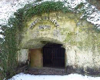](Mergelgroeve/Mergelgroeve.html) [Mergelgroeve](Mergelgroeve/Mergelgroeve.html) 
| [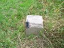](Merksteen_RD/Merksteen_RD.html) [Merksteen RD](Merksteen_RD/Merksteen_RD.html) 
| [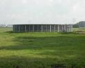](Mestopslag_Mestsilo/Mestopslag_Mestsilo.html) [Mestopslag / Mestsilo](Mestopslag_Mestsilo/Mestopslag_Mestsilo.html) 
| [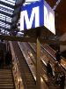](Metro/Metro.html) [Metro](Metro/Metro.html) 
| [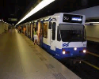](Metrostation/Metrostation.html) [Metrostation](Metrostation/Metrostation.html) 
| [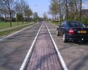](Middenberm/Middenberm.html) [Middenberm](Middenberm/Middenberm.html) 
| [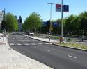](Middencontour/Middencontour.html) [Middencontour](Middencontour/Middencontour.html) 
| [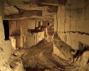](Mijn/Mijn.html) [Mijn](Mijn/Mijn.html) 
Mijnsteenberg
| [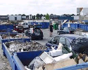](Milieustraat/Milieustraat.html) [Milieustraat](Milieustraat/Milieustraat.html) 
| [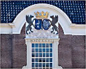](Militair_gebouw/Militair_gebouw.html) [Militair gebouw](Militair_gebouw/Militair_gebouw.html) 
| [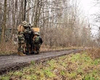](Militair_oefenterrein/Militair_oefenterrein.html) [Militair oefenterrein](Militair_oefenterrein/Militair_oefenterrein.html) 
| [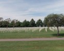](Militaire_begraafplaats/Militaire_begraafplaats.html) [Militaire begraafplaats](Militaire_begraafplaats/Militaire_begraafplaats.html) 
|  [Militaire vliegbasis](Militaire_vliegbasis/Militaire_vliegbasis.html) 
|  [MIVD-richtlijn](MIVD-richtlijn/MIVD-richtlijn.html) 
| [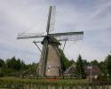](Molen/Molen.html) [Molen](Molen/Molen.html) 
| [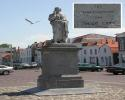](Monument/Monument.html) [Monument](Monument/Monument.html) 
|  [Moskee](Moskee/Moskee.html) 
|  [Mosselbank](Mosselbank/Mosselbank.html) 
|  [Mosselperceel](Mosselperceel/Mosselperceel.html) 
|  [Motel](Motel/Motel.html) 
|  [Mountainbikepad](Mountainbikepad/Mountainbikepad.html) 
| [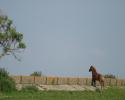](Muraltmuur/Muraltmuur.html) [Muraltmuur](Muraltmuur/Muraltmuur.html) 
| [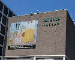](Museum/Museum.html) [Museum](Museum/Museum.html) 
| [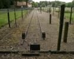](Museumlijn/Museumlijn.html) [Museumlijn](Museumlijn/Museumlijn.html) 
| [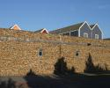](Muur/Muur.html) [Muur](Muur/Muur.html) 
