| [A](../A/A.html) | [B](../B/B.html) | [C](../C/C.html) | [D](../D/D.html) | [E](../E/E.html) | [F](../F/F.html) |
| [G](../G/G.html) | [H](../H/H.html) | [I](../I/I.html) | [J](../J/J.html) | [K](../K/K.html) | [L](../L/L.html) |
| [M](../M/M.html) | [N](../N/N.html) | [O](../O/O.html) | [P](../P/P.html) | [R](../R/R.html) | [S](../S/S.html) |
| [T](../T/T.html) | [U](../U/U.html) | [V](../V/V.html) | [W](../W/W.html) | [Z](../Z/Z.html) |

O
=

|     |     |     |     |     |
| --- | --- | --- | --- | --- |

| [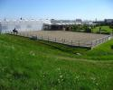](Object/Object.html) [Object](Object/Object.html)
|  [Objectklasse](Objectklasse/Objectklasse.html)
Observatiepunt
Observatorium
| [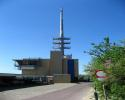](Obstakel/Obstakel.html) [Obstakel](Obstakel/Obstakel.html)
| [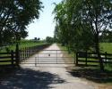](Obstakel_dwars_over_een_weg/Obstakel_dwars_over_een_weg.html) [Obstakel dwars over een weg](Obstakel_dwars_over_een_weg/Obstakel_dwars_over_een_weg.html)
| [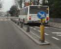](Obstakel_in_de_lengterichting_van_een_weg/Obstakel_in_de_lengterichting_van_een_weg.html) [Obstakel in de lengterichting van een weg](Obstakel_in_de_lengterichting_van_een_weg/Obstakel_in_de_lengterichting_van_een_weg.html)
|  [Oeverbescherming](Oeverbescherming/Oeverbescherming.html)
| [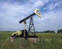](Oliepompinstallatie/Oliepompinstallatie.html) [Oliepompinstallatie](Oliepompinstallatie/Oliepompinstallatie.html)
| [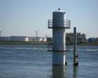](Olietank/Olietank.html) [Olietank](Olietank/Olietank.html)
| [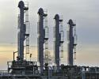](Oliewinning/Oliewinning.html) [Oliewinning](Oliewinning/Oliewinning.html)
|  [Onderhout](Onderhout/Onderhout.html)
|  [Ondiepte](Ondiepte/Ondiepte.html)
|  [Onland](Onland/Onland.html)
| [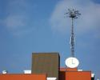](Ontvangstmast/Ontvangstmast.html) [Ontvangstmast](Ontvangstmast/Ontvangstmast.html)
| [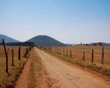](Onverharde_weg/Onverharde_weg.html) [Onverharde weg](Onverharde_weg/Onverharde_weg.html)
|  [Op- en afrit](Op_Afrit/Op_Afrit.html)
|  [Openbaar](Openbaar/Openbaar.html)
| [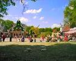](Openluchtmuseum/Openluchtmuseum.html) [Openluchtmuseum](Openluchtmuseum/Openluchtmuseum.html)
| [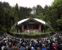](Openluchttheater/Openluchttheater.html) [Openluchttheater](Openluchttheater/Openluchttheater.html)
| [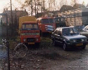](Opstelplaats/Opstelplaats.html) [Opstelplaats](Opstelplaats/Opstelplaats.html)
| [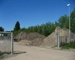](Overig_bodemgebruik/Overig_bodemgebruik.html) [Overig bodemgebruik](Overig_bodemgebruik/Overig_bodemgebruik.html)
| [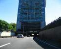](Overkluisde_beek/Overkluisde_beek.html) [Overkluisde beek](Overkluisde_beek/Overkluisde_beek.html)
| [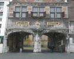](Overkluizing/Overkluizing.html) [Overkluizing](Overkluizing/Overkluizing.html)
