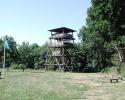
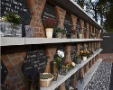

| [A](../A/A.html) | [B](../B/B.html) | [C](../C/C.html) | [D](../D/D.html) | [E](../E/E.html) | [F](../F/F.html) |
| [G](../G/G.html) | [H](../H/H.html) | [I](../I/I.html) | [J](../J/J.html) | [K](../K/K.html) | [L](../L/L.html) |
| [M](../M/M.html) | [N](../N/N.html) | [O](../O/O.html) | [P](../P/P.html) | [R](../R/R.html) | [S](../S/S.html) |
| [T](../T/T.html) | [U](../U/U.html) | [V](../V/V.html) | [W](../W/W.html) | [Z](../Z/Z.html) |

U
=

<!--

|     |     |     |     |     |
| --- | --- | --- | --- | --- |

Uitloopterrein
|  [Uitwateringsduiker](Uitwateringsduiker/Uitwateringsduiker.html)
|  [Uitwateringssluis](Uitwateringssluis/Uitwateringssluis.html)
|  [Uitzichtpunt](Uitzichtpunt/Uitzichtpunt.html)
|  [Uitzichttoren](Uitzichttoren/Uitzichttoren.html)
|  [Universiteit](Universiteit/Universiteit.html)
|  [Urnenmuur / Columbarium](Urnenmuur/Urnenmuur.html)

-->
