| [A](../A/A.html) | [B](../B/B.html) | [C](../C/C.html) | [D](../D/D.html) | [E](../E/E.html) | [F](../F/F.html) |
| [G](../G/G.html) | [H](../H/H.html) | [I](../I/I.html) | [J](../J/J.html) | [K](../K/K.html) | [L](../L/L.html) |
| [M](../M/M.html) | [N](../N/N.html) | [O](../O/O.html) | [P](../P/P.html) | [R](../R/R.html) | [S](../S/S.html) |
| [T](../T/T.html) | [U](../U/U.html) | [V](../V/V.html) | [W](../W/W.html) | [Z](../Z/Z.html) |

W
=

<!--

|     |     |     |     |     |
| --- | --- | --- | --- | --- |

|  [Wad](Wad/Wad.html)
| [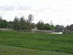](Wal/Wal.html) [Wal](Wal/Wal.html)
|  [Warenhuis](Warenhuis/Warenhuis.html)
|  [Waterbak](Waterbak/Waterbak.html)
| [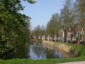](Waterdeel/Waterdeel.html) [Waterdeel](Waterdeel/Waterdeel.html)
Watergebied
|  [Waterkering](Waterkering/Waterkering.html)
|  [Waterleiding -pompstation](Waterleiding_-pompstation/Waterleiding_-pompstation.html)
Waterloop
Watermolen
|  [Waterradmolen](Waterradmolen/Waterradmolen.html)
| [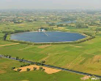](Waterreservoir/Waterreservoir.html) [Waterreservoir](Waterreservoir/Waterreservoir.html)
|  [Waterschap](Waterschap/Waterschap.html)
| [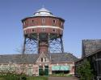](Watertoren/Watertoren.html) [Watertoren](Watertoren/Watertoren.html)
| [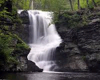](Waterval/Waterval.html) [Waterval](Waterval/Waterval.html)
|  [Waterzuiveringsinstallatie](Waterzuiverings-installatie/Waterzuiverings-installatie.html)
| [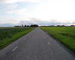](Weg/Weg.html) [Weg](Weg/Weg.html)
Weg_achter_boerderij
Weg_Geïntegreerd
Weg_in_aanleg
Weg_in_ontwerp
Weg_in_tunnel
Weg_op_dijk
Weg_op_pijlers
Weg_Parallel
Weg_Vrijliggend
|  [Wegafsluiting / Wegafsluiter](Wegafsluiting/Wegafsluiting.html)
|  [Wegenclassificaties](Wegenclassificaties/Wegenclassificaties.html)
Wegenwacht-station
Wegnaam
| [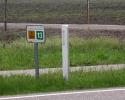](Wegnummering/Wegnummering.html) [Wegnummering](Wegnummering/Wegnummering.html)
Wegrestaurant
| [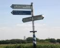](Wegwijzer/Wegwijzer.html) [Wegwijzer](Wegwijzer/Wegwijzer.html)
| [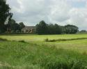](Weiland/Weiland.html) [Weiland](Weiland/Weiland.html)
|  [Wel](Wel/Wel.html)
| [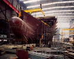](Werf/Werf.html) [Werf](Werf/Werf.html)
| [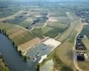](Werkhaven/Werkhaven.html) [Werkhaven](Werkhaven/Werkhaven.html)
|  [Wiel](Wiel/Wiel.html)
niet hier: keyword|  [Terp, Wierde](../T/Terp/Terp.html)
Wijk
|  [Wijk (Registratief gebied)](Wijk_Registratief_gebied/Wijk_Registratief_gebied.html)
| [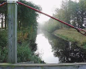](Wijk_Sloot_of_kanaal/Wijk_Sloot_of_kanaal.html) [Wijk (Sloot of kanaal)](Wijk_Sloot_of_kanaal/Wijk_Sloot_of_kanaal.html)
| [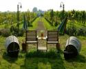](Wijngaard/Wijngaard.html) [Wijngaard](Wijngaard/Wijngaard.html)
|  [Wildviaduct](Wildviaduct/Wildviaduct.html)
| [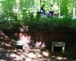](Wildwissel/Wildwissel.html) [Wildwissel](Wildwissel/Wildwissel.html)
Windbreker
| [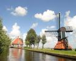](Windmolen/Windmolen.html) [Windmolen](Windmolen/Windmolen.html)
|  [Windmolentje](Windmolentje/Windmolentje.html)
Windmotor
|  [Windscherm](Windscherm/Windscherm.html)
| [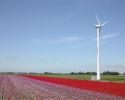](Windturbine/Windturbine.html) [Windturbine](Windturbine/Windturbine.html)
| [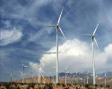](Windturbinepark/Windturbinepark.html) [Windturbinepark](Windturbinepark/Windturbinepark.html)
| [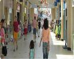](Winkelcentrum/Winkelcentrum.html) [Winkelcentrum](Winkelcentrum/Winkelcentrum.html)
|  [Winterpeil](Winterpeil/Winterpeil.html)
Wisselstrook
|  [Woonboot](Woonboot/Woonboot.html)
Woonkern
Woonwagen
| [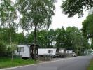](Woonwagencentrum/Woonwagencentrum.html) [Woonwagencentrum](Woonwagencentrum/Woonwagencentrum.html)
| [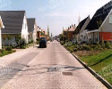](Woonwijk/Woonwijk.html) [Woonwijk](Woonwijk/Woonwijk.html)

-->
